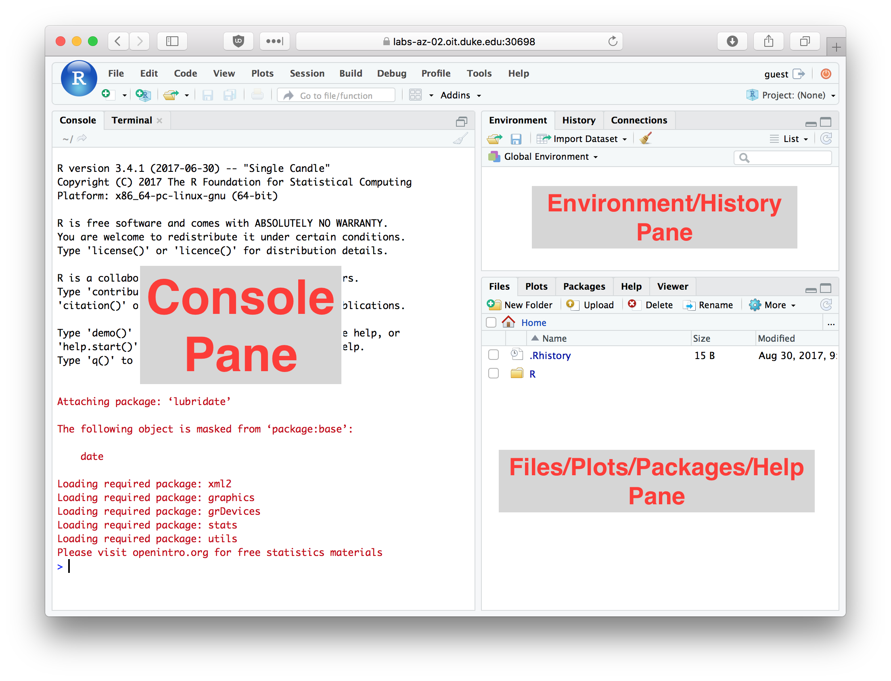

# Getting Started with R


## What is R?

R is a statistical computing environment and programming language.  It is free, open source, and has a large and active community of developers and users.  There are many different R packages (libraries) available for conducting out a wide variety of different analyses, for everything from genome sequence data to geospatial information.

## What is RStudio?

RStudio (http://www.rstudio.com/) is an open source integrated development environment (IDE) that provides a nicer graphical interface to R than does the default R GUI.

The figure below illustrates the RStudio interface, in it's default configuration.  For the exercises below you'll be primarily entering commands in the "console" window. We'll review key parts of the RStudio interface in greater detail in class.

```{r, echo = FALSE, out.width = "600px", fig.align = "center", fig.cap = "RStudio window with the panes labeled", results="markup"}

```

## Entering commands in the console

You can type commands directly in the console. When you hit Return (Enter) on your keyboard the text you typed is evaluated by the R interpreter.  This means that the R program reads your commands, makes sure there are no syntax errors, and then carries out any commands that were specified.  

Try evaluating the following arithmetic commands in the console:

```{r}
10 + 5
10 - 5
10 / 5
10 * 5
```

If you type an incomplete command and then hit Return on your keyboard, the console will show a continuation line marked by a `+` symbol. For example enter the incomplete statement `(10 + 5` and then hit Enter. You should see something like this.  

```
> (10 + 5
+
```

The continuation line tells you that R is waiting for additional input before it evaluates what you typed. Either complete your command (e.g. type the closing parenthesis) and hit Return, or hit the "Esc" key to exit the continuation line without evaluating what you typed.

## Comments

When working in the R console, or writing R code, the pound symbol (`#`) indicates the start of a comment.  Anything after the `#`, up to the end of the current line, is ignored by the R interpretter.

```{r}
# This line will be ignored
5 + 4 # the first part of this line, up to the #, will be evaluated
```

Throughout this course I will often include short explanatory comments in my code examples.

## Using R as a Calculator

The simplest way to use R is as a fancy calculator.

```{r, echo=TRUE, eval=FALSE}
10 + 2 # addition
10 - 2 # subtraction
10 * 2 # multiplication
10 / 2 # division
10 ^ 2 # exponentiation
10 ** 2 # alternate exponentiation
pi * 2.5^2 # R knows about some constants such as Pi
10 %% 3 # modulus operator -- gives remainder after division
10 %/% 3 # integer division
```

Be aware that certain operators have precedence over others. For example multiplication and division have higher precedence than addition and subtraction. Use parentheses to disambiguate potentially confusing statements.

```{r}
(10 + 2)/4-5   # was the output what you expected?
(10 + 2)/(4-5) # compare the answer to the above
```

Division by zero produces an object that represents infinite numbers. Infinite values can be either positive or negative

```{r}
1/0  # Inf
-1/0 # -Inf
```

Invalid calculations produce a objected called `NaN` which is short for "Not a Number":

```{r}
0/0  # invalid calculation
```

### Common mathematical functions

Many commonly used mathematical functions are built into R. Here are some examples:

```{r}
abs(-3)   # absolute value
abs(3)
cos(pi/3) # cosine
sin(pi/3) # sine
log(10)   # natural logarithm
log10(10) # log base 10
log2(10) # log base 2
exp(1)    # exponential function
sqrt(10)  # square root
10 ^ 0.5  # same as square root
```


## Numeric data types in R

There are three standard types of numbers in R.  You can use the function `typeof()` to get information about an objects type in R.

  1) "double" -- this is the default numeric data type, and is used to represent both real numbers and whole numbers (unless you explicitly ask for integers, see below).  "double" is short for "double precision floating point value".  All of the previous computations you've seen up until this point used data of type double.
  
    ```{r}
    typeof(10.0)  # real number
    typeof(10)  # whole numbers default to doubles
    ```
  
  2) "integer" -- when your numeric data involves only whole numbers, you can get slighly better performance using the integer data type. You must explicitly ask for numbers to be treated as integers.
  
    ```{r}
    typeof(as.integer(10))  # now treated as an integer
    ```
    
  3) "complex" -- R has a built-in data type to represent complex numbers -- numbers with a "real" and "imaginary" component.  We won't encounter the use of complex numbers in this course, but they do have many important uses in mathematics and engineering and also have some interesting applications in biology.
  
    ```{r}
    typeof(1 + 0i)
    sqrt(-1)      # sqrt of -1, using doubles
    sqrt(-1 + 0i) # sqrt of -1, using complex numbers
    ```

## Variable assignment in R

An important programming concept in all programming languages is that of "variable assignment".  Variable assignment is the act of creating labels that point to particular data values in a computers memory, which allows us to apply operations to the labels rather than directly to specific.  Variable assignment is an important mechanism of abstracting and generalizing computational operations.

Variable assignment in R is accomplished with the assignment operator, which is designated as `<-` (left arrow, constructed from a left angular brack and the minus sign). This is illustrated below:

```{r}
x <- 10  # assign the variable name 'x' the value 10
sin(x)   # apply the sin function to the value x points to
x <- pi  # x now points to a different value
sin(x)   # the same function call now produces a different result 
```

### Valid variable names

As described in the [R documentation](https://stat.ethz.ch/R-manual/R-devel/library/base/html/make.names.html), "A syntactically valid name consists of letters, numbers and the dot or underline characters and starts with a letter or the dot not followed by a number. Names such as '.2way' are not valid, and neither are the [reserved words](https://stat.ethz.ch/R-manual/R-devel/library/base/html/Reserved.html)." 

Here are some examples of valid and invalid variable names. Mentally evaluate these based on the definition above, and then evaluate these in the R interpetter to confirm your understanding :

```
x <- 10
x.prime <- 10
x_prime <- 10
my.long.variable.name <- 10
another_long_variable_name <- 10
_x <- 10
.x <- 10
2.x <- 2 * x
```


## Working with Vectors in R

Vectors are the core data structure in R. Vectors store an ordered lists of items, *all of the same type*. Learning to compute effectively with vectors and one of the keys to efficient R programming.  Vectors in R always have a type (accessed with the `typeof()` function) and a length (accessed with the `length()` function).

The simplest way to create a vector at the interactive prompt is to use the `c()` function, which is short hand for `combine' or `concatenate'.

```{r}
x <- c(2,4,6,8)  # create a vector, assignn it the variable name `x`
length(x)
typeof(x)
```


You can also use `c()` to concatenate two or more vectors together.

```{r}
y <- c(1,3,5,7,9)  # create another vector, labeled y
xy <- c(x,y)  # combine two vectors

z <- c(pi/4, pi/2, pi, 2*pi)
xyz <- c(x, y, z)  # combine three vectors
```

### Vector Arithmetic

The basic R arithmetic operations work on vectors as well as on
single numbers (in fact single numbers *are* vectors).

```{r}
x <- c(2, 4, 6, 8, 10)
x * 2  # multiply each element of x by 2
x - pi # subtract pi from each element of x

y <- c(0, 1, 3, 5, 9)
x + y  # add together each matching element of x and y
x * y # multiply each matching element of x and y
x/y # divide each matching element of x and y
```

Basic numerical functions operate element-wise on numerical vectors:

```{r}
sin(x)
cos(x * pi)
log(x)
```

### Vector recycling

When vectors are not of the same length R `recycles' the elements of the
shorter vector to make the lengths conform. 

```{r}
x <- c(2, 4, 6, 8, 10)
length(x)
z <- c(1, 4, 7, 11)
length(z)
x + z
```

In the example above `z` was treated as if it was the vector `(1, 4, 7, 11, 1)`.

### Simple statistical functions for numeric vectors

Now that we've introduced vectors as the simplest data structure for holding collections of numerical values, we can introduce a few of the most common statistical functions that operate on such vectors.

First let's create a vector to hold our sample data of interest. Here I've taken a random sample of the lengths of the last names of students enrolled in Bio 723 during Spring 2018.

```{r}
len.name <- c(7, 7, 6, 2, 9, 9, 7, 4, 10, 5)
```

Some common statistics of interest include minimum, maximum, mean, median, variance, and standard deviation:

```{r}
min(len.name)
max(len.name)
mean(len.name)
median(len.name)
var(len.name)  # variance
sd(len.name)   # standard deviation
```

The `summary()` function applied to a vector of doubles produce a useful table of some of these key statistics:

```{r}
summary(len.name)
```

## The R Help System

R comes with fairly extensive documentation and a simple help system. You can access HTML versions of the R documentation under the Help tab in Rstudio.  The HTML documentation also includes information on any packages you've installed. Take a few minutes to browse through the R HTML documentation. In addition to the HTML documentation there is also a search box where you can enter a term to search on (see red arrow in figure below).


```{r, echo = FALSE, out.width = "600px", fig.align = "center", fig.cap = "The RStudio Help tab", results="markup"}
knitr::include_graphics("./figures/fig-rstudio-help.png")
```


### Getting help from the console

In addition to getting help from the RStudio help tab, you can directly search for help from the console. The help system can be invoked using the `help` function or the `?` operator.

```{r}
help("log")
?log
```

If you are using RStudio, the help results will appear in the "Help" tab of the Files/Plots/Packages/Help/Viewer  (lower right window by default).

What if you don't know the name of the function you want? You can use the `help.search()` function.

```{r}
help.search("log")
```

In this case `help.search("log")` returns all the functions with
the string `log` in them. For more on `help.search` type
`?help.search`. 

Other useful help related functions include `apropos()` and `example()`.  `apropos` returns a list of all objects (including function names) in the current session that match the input string.

```{r}
apropos("log")
```

`example()` provides  examples of how a function is used.

```{r}
example(log)
```


## Packages {#packages}
  
Packages are libraries of R functions and data that provide additional capabilities and tools beyond the standard library of functions included with R.  Hundreds of people around the world have developed packages for R that provide functions and related data structures  for conducting many different types of analyses.

Throughout this course you'll need to install a variety of packages. Here I show the basic procedure for installing new packages from the console as well as from the R Studio interface.

### Installing packages from the console

The built-in function `install.packages` provides a quick and conveniet way to install packages from the R console.  

### Install the tidyverse package

To illustrate the use of `install.package`, we'll install a collection of packages (a "meta-package") called the [tidyverse](http://www.tidyverse.org).  Here's how to install the tidyverse meta-package from the R console:

```{r, eval = FALSE}
install.packages("tidyverse", dependencies = TRUE)
```

The first argument to `install.packages` gives the names of the package we want to install. The second argument, `dependencies = TRUE`, tells R to install any additional packages that tidyverse depends on.


### Installing packages from the RStudio dialog

You can also install packages using a graphical dialog provided by RStudio. To do so pick the `Packages` tab in RStudio, and then click the `Install` button.  

```{r, echo = FALSE, out.width = "600px", fig.align = "center", fig.cap = "The Packages tab in RStudio", results="markup"}
knitr::include_graphics("./figures/fig-rstudio-packages-tab.png")
```

In the packages entry box you can type the name of the package you wish to install. 


### Install the stringr package

Let's install another useful package called "stringr".  Type the package name in the "Packages" field, make sure the "Install dependencies" check box is checked, and then press the "Install" button.

```{r, echo = FALSE, out.width = "300px", fig.align = "center", fig.cap = "Package Install Dialog", results="markup"}
knitr::include_graphics("./figures/fig-rstudio-package-install-stringr.png")
```

### Loading packages with the `library()` function

Once a package is installed on your computer, the package can be loaded into your R session using the `library` function.  To insure our previous install commands worked correctly, let's load the packages we just installed.

```{r, eval=FALSE}
library(stringr)
library(tidyverse)
```

Since the tidyverse pacakge is a "meta-package" it provides some additional info about the sub-packages that got loaded.  

When you load tidyverse, you will also see a message about "Conflicts" as several of the functions provided in the dplyr package (a sub-package in tidyverse) conflict with names of functions provided by the "stats" package which usually gets automically loaded when you start R.  The conflicting funcdtions are `filter` and `lag`. The conflicting functions in the stats package are `lag` and `filter` which are used in time series analysis.  The `dplyr` functions are  more generally useful. Furthermore, if you need these masked functions you can still access them by prefacing the function name with the name of the package (e.g. `stats::filter`).

