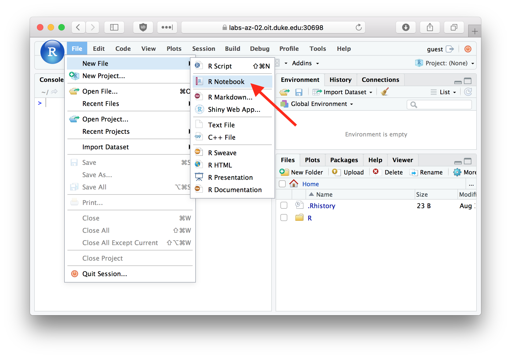
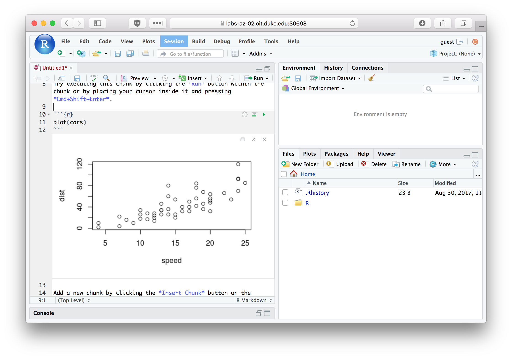
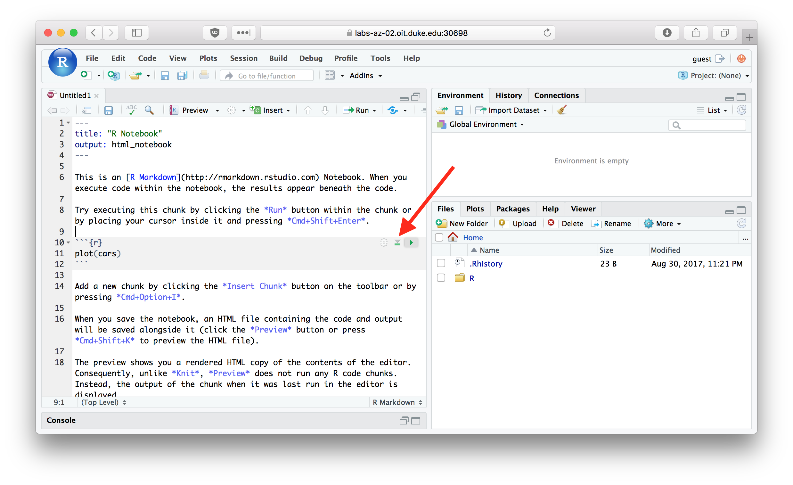
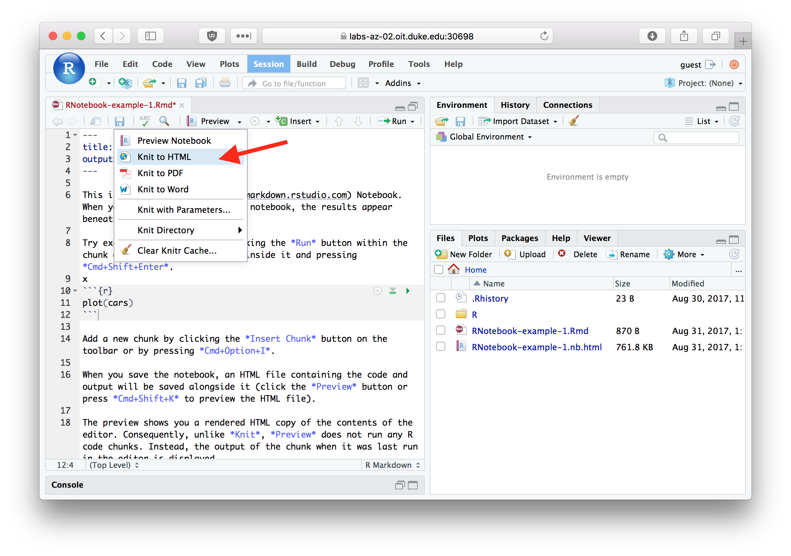

#  R Markdown and R Notebooks

RStudio comes with a useful set of tools, collectively called R Markdown, for generating "literate" statistical analyses.  The idea behind literate statistical computing is that we should try to carry out our analyses in a manner that is transparent, self-explanatory, and reproducible.   Literate statistical computing helps to ensure your research is reproducible because:

 1. The steps of your analyses are explicitly described, both as written text and the code and function calls used.
 2. Analyses can be more easily checked for correctness and reproduced from your literate code.
 3. Your literate code can serve as a template for future analyses, saving you time and the trouble of remembering all the gory details.

As we'll see, R Markdown will allow us to produce statistical documents that integrateprose, code, figures, and nicely formatted mathematics so that we can share and explain our analyses to others.  Sometimes those "others" are advisors, supervisors, or collaborators; sometimes the other is you six months from now.  For the purposes of this class, you will be asked to complete problem sets in the form of R Markdown documents.


R Markdown documents are written in a light-weight markup language called Markdown.  Markdown provides simple plain text "formatting" commands for specifying the structured elements of a document. Markdown was invented as a lightweight markup language for creating web pages and blogs, and has been adopted to a variety of different purposes.  This hands-on provides a brief introduction to the capabilities of R Markdown.  For more complete details, including lots of examples, see the [R Markdown Website](http://rmarkdown.rstudio.com/index.html).

## R Notebooks

We're going to create a type of R Markdown document called an "R Notebook". The [R Notebook Documentation](http://rmarkdown.rstudio.com/r_notebooks.html) describes R Notebooks as so: "An R Notebook is an R Markdown document with code chunks that can be executed independently and interactively, with output visible immediately beneath the input."

## Creating an R Notebook

To create an R Notebook select `File > New File > R Notebook` from the files menu in RStudio.

```{r, echo = FALSE, out.width = "600px", fig.align = "center", fig.cap = "Using the File menu to create a new R Notebook.", results="markup"}

```

## The default R Notebook template

The standard template that RStudio creates for you includes a header section
like the following where you can specify document properties such as 
the title, author, and change the look and feel of the generated HTML document.

```
---
title: "R Notebook"
output: html_notebook
---
```


The header is followed by several example sections that illustrate a few of the capabilities of R Markdown.  Delete these and replace them with your own code as necessary.

## Code and Non-code blocks

R Markdown documents are divided into code blocks (also called "chunks") and non-code blocks.  Code blocks are sets of R commands that will be evalauted when the R Markdown document is run or "knitted" (see below). Non-code blocks include explanatory text, embedded images, etc. The default notebook template includes both code and non-code blocks.


### Non-code blocks

The first bit of text in the default notebook template is a non-code block that tells you how to use the notebook:

```
This is an [R Markdown](http://rmarkdown.rstudio.com) Notebook. When you execute code within the notebook, the results appear beneath the code. 

Try executing this chunk by clicking the *Run* button within the chunk or by placing your cursor inside it and pressing *Cmd+Shift+Enter*. 
```

The text of non-code blocks can include lightweight markup information that can be used to format HTML or PDF output generated from the R Markdown document.  Here are some examples:

```
# Simple textual formatting 

This is a paragraph with plain text.  Nothing fancy will happen here.

This is a second paragraph with *italic*, **bold**, and `verbatim` text. 

# Lists

## Bullet points lists

This is a list with bullet points:

  * Item a
  * Item b
  * Item c

## Numbered lists
  
This is a numbered list:

  1. Item 1
  #. Item 2
  #. Item 3
  
## Mathematics

R Markdown supports mathematical equations, formatted according to LaTeX conventions. Dollar signs ($) are used to offset mathematics like so $x^2 + y^2 = z^2$.

```
#### Typeset mathematics

R Markdown supports LaTeX style formatting of mathematical equations.  For example, `$x^2 + y^2 = z^2$` appears as $x^2 + y^2 = z^2$.

### Code blocks

Code blocks are delimited by matching sets of three backward ticks (```).  Everything within a code block is interpretted as an R command and is evaluated by the R interpretter. Here's the first code block in the default notebook template:

```
```{r}
plot(cars)
```
```


## Running a code chunk

You can run a single code block by clicking the small green "Run" button in the upper right hand corner of the code block as shown in the image below.  

```{r, echo = FALSE, out.width = "600px", fig.align = "center", fig.cap = "Click the Run button to execute a code chunk.", results="markup"}
knitr::include_graphics("./figures/fig-run-code-chunk.png")
```

If you click this button the commands within this code block are executed, and any generated output is shown below the code block.  

Try running the first code block in the default template now.  After the code chunk is executed you should see a plot embedded in your R Notebook as shown below:

```{r, echo = FALSE, out.width = "600px", fig.align = "center", fig.cap = "An R Notebook showing an embedded plot after executing a code chunk.", results="markup"}

```

## Running all code chunks above

Next to the "Run" button in each code chunk is a button for "Run all chunks above" (see figure below).  This is useful when the code chunk you're working on depends on calculations in earlier code chunks, and you want to evaluated those earlier code chunks prior to running the focal code chunk.  

```{r, echo = FALSE, out.width = "600px", fig.align = "center", fig.cap = "Use the 'Run all chunks above' button to evaluate all previous code chunks.", results="markup"}

```


## "Knitting an" R Markdown to HTML

Save your R Notebook as `first_rnotebook.Rmd` (RStudio will automatically add the `.Rmd` extension so you don't need to type it).  You can generate an HTML version of your notebook by clicking the "Preview" menu on the Notebook taskbar and then choosing "Knit to HTML" (see image below).

```{r, echo = FALSE, out.width = "600px", fig.align = "center", fig.cap = "Use the 'Knit to HTML' menu to generate HTML output from your R Notebook", results="markup"}

```

When an RMarkdown document is "knit", all of the code and non-code blocks are executed in a "clean" environment, in order from top to bottom.  An output file is generated (HTML or one of the other available output types) that shows the results of executing the notebook.  By default RStudio will pop-up a window showing you the HTML output you generated.

Knitting a document is a good way to make sure your analysis is reproducible.  If your code compiles correctly when the document is knit, and produces the expected output, there's a good chance that someone else will be able to reproduce your analyses independently starting with your R Notebook document (after accounting for differences in file locations).

## Sharing your reproducible R Notebook

To share your R Notebook with someone else you just need to send them the source R Markdown file (i.e. the file with the `.Rmd` extension). Assuming they have access to the same source data, another user should be able to open the notebook file in RStudio and regenerate your analyses by evaluating the individual code chunks or knitting the document.

In this course you will be submitting homework assignments in the form of R Notebook markdown files.


