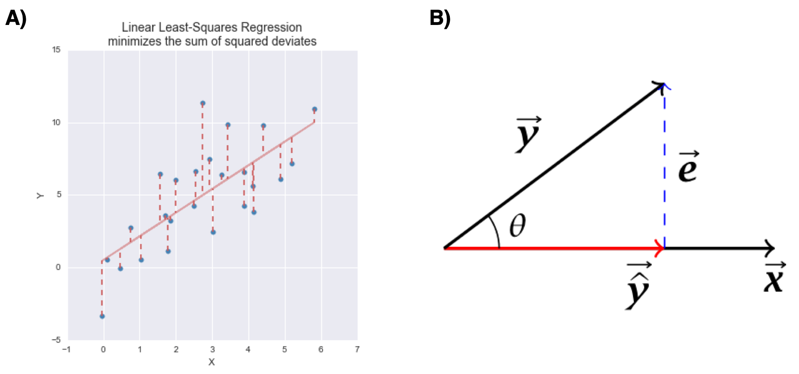
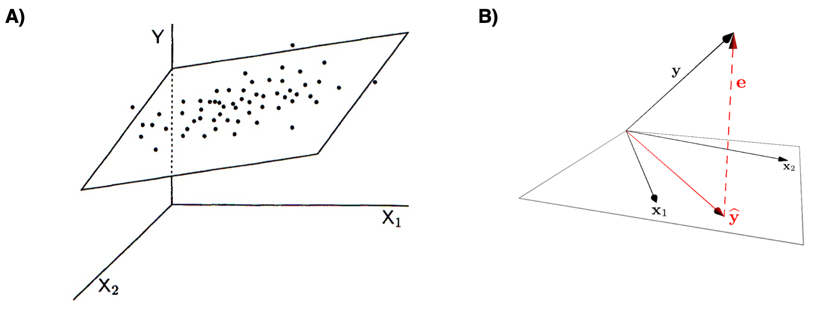
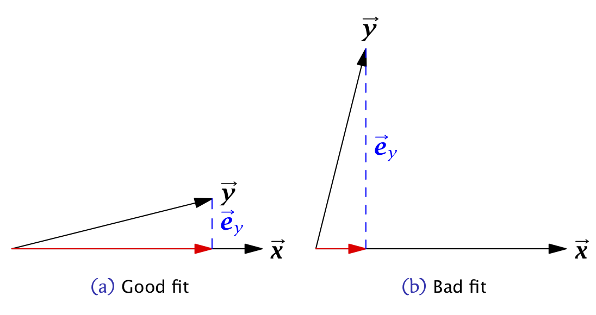

# Linear Regression Models

Statistical models are quantitative statements about how we think variables are related to each other. 
Linear models are among the simplest statistical models.  In a linear model relating two variables $X$ and $Y$, the general form of the model can be stated as "I assume that $Y$ can be expressed as a linear function of $X$".  The process of *model fitting* is then the task of finding the coefficients (parameters) of the linear model which best fit the observed data.

As we talk about regression models we'll frequently use the following terms:

- **Predictors, explanatory, or independent variable** -- the variables from which we want to make our prediction.

- **Outcomes, dependent, or response variable** -- the variable we are trying to predict in our models. 

## Linear functions

A linear function of a single variable $X$  can be written as: 

$$
f(X) = a + bX
$$

where $a$ and $b$ are constants.  In  geometric terms $b$ is the *slope of the line* and $a$ is the value of the function when $X$ is zero (usually the referred to as the "Y-intercept"). The slope tells you have much $f(X)$ changes per unit change of $X$. If we treat $X$ as a vector, this linear function can be expressed as the vector equation:

$$
f(\vec{\mathbf{x}}) = a\vec{\mathbf{1}} + b\vec{\mathbf{x}} 
= a\begin{bmatrix}1 \\ 1 \\ \vdots \\ 1\end{bmatrix} + b\begin{bmatrix}x_1 \\ x_2 \\ \vdots \\ x_p\end{bmatrix}
$$

We can also create linear functions of multiple variables, $X_1, X_2, \ldots, X_m$.  A linear function of multiple variables can be expressed as:

$$
f(X_1, X_2,\ldots,X_m) = a + b_1X_1 + b_2X_2 + \cdots + b_mX_m
$$

where $a$ is the intercept and $b_1, b_2,\ldots,b_m$ are slopes with respect to each of the $X$s. 

In vector terms this is:

$$
\begin{eqnarray*}
f(\vec{\mathbf{x}_1}, \vec{\mathbf{x}_2}, \ldots, \vec{\mathbf{x}_m}) &=& a\vec{\mathbf{1}} + b_1\vec{\mathbf{x}_1} + b_2\vec{\mathbf{x}_2} + \ldots + b_m\vec{\mathbf{x}_m} \\
&=& a\begin{bmatrix}1 \\ 1 \\ \vdots \\ 1\end{bmatrix} + b_1\begin{bmatrix}x_{1,1} \\ x_{2,1} \\ \vdots \\ x_{p,1}\end{bmatrix} + b_2\begin{bmatrix}x_{1,2} \\ x_{2,2} \\ \vdots \\ x_{p,2}\end{bmatrix} + \cdots + b_m\begin{bmatrix}x_{1,m} \\ x_{2,m} \\ \vdots \\ x_{p,m}\end{bmatrix}
\end{eqnarray*}
$$

If we bundle the individual $\vec{\mathbf{x}}$ vectors into a matrix $\mathbf{X}$ we can rewrite the linear function of multiple variables as

$$
f(\vec{\mathbf{x}_1}, \vec{\mathbf{x}_2}, \ldots, \vec{\mathbf{x}_m}) = \mathbf{X}\vec{\mathbf{b}}
$$

where

$$
\mathbf{X} = 
\begin{bmatrix}
1 & x_{1,1} & x_{1,2} & \cdots & x_{1,m} \\
1 & x_{2,1} & x_{2,2} & \cdots & x_{2,m} \\
\vdots & \vdots & \vdots & \ddots & \vdots \\
1 & x_{n,1} & x_{n,2} & \cdots & x_{n,m} \\
\end{bmatrix}
\text{ and }
\vec{\mathbf{b}} = 
\begin{bmatrix}
a \\
b_1 \\
b_2 \\
\vdots \\
b_m
\end{bmatrix}
$$


## Linear regression


In **bivariate linear regression** we assume that our outcome variable ($Y$) can be expressed as a linear function of a single predictor variable ($X$) plus an error term.  The error term can be thought of as the portion of $Y$ that is "unexplained" by the linear function.

$$
\begin{eqnarray*}
Y &=& f(X) + \text{error} \\ 
  &=& a + bX + \text{error}
\end{eqnarray*}
$$
The vector equivalent is:

$$
\vec{\mathbf{y}} = a\vec{\mathbf{1}} + b\vec{\mathbf{x}} + \vec{\mathbf{e}}
$$


Similarly, in **multiple linear regression** we assume that the outcome variable ($Y$) can be expressed as a linear function of multiple predictor variables  ($X_1, X_2, \ldots, X_m$) plus an error term, $\epsilon$:

$$
Y = f(X_1, X_2,\ldots,X_m) + \epsilon
$$

The vector representation of the multiple regression model is:

$$
\vec{\mathbf{y}} = a\vec{\mathbf{1}} + b_1\vec{\mathbf{x}_1} + b_2\vec{\mathbf{x}_2} + \ldots + b_m\vec{\mathbf{x}_m} + \vec{\mathbf{e}} 
$$

In matrix form, this is represented as:

$$
\vec{\mathbf{y}} = \mathbf{X}\vec{\mathbf{b}} +  \vec{\mathbf{e}} 
$$
where $\mathbf{X}\vec{\mathbf{b}}$ is a matrix of the predictor variables with the ones vector prepended to it as described above.


We see that bivariate linear regression is just a special case of multiple regression.


In the rest of this document I will replace the linear functions $f$ above with $\widehat{Y}$ to indicate the component of $Y$ that is predicted ("explained") by the $X$s:

$$
Y = \widehat{Y}+ \epsilon
$$

The equivalent vector representation is:

$$
\vec{\mathbf{y}} = \vec{\widehat{\mathbf{y}}} + \vec{\mathbf{e}} 
$$


## The optimality criterion for least-squares regression


There are infinitely many linear functions of $X$ we could define. Which linear function provides the best fit given our observed values of$Y$ and $X$? In order to fit a model to data, we have to specify some criterion for judging how well alternate models perform.  

For regression, the optimality criterion can be expressed as "Find the linear function, $\widehat{Y} = f(X)$, that minimizes the following quantity:"

$$
\sum \epsilon^2 = \sum (y_i - \widehat{y}_i)^2
$$
In vector terms we are minimizing:

$$
|\vec{\mathbf{e}}|^2 = |\vec{\mathbf{y}}  - \vec{\widehat{\mathbf{y}}} |^2
$$


That is, our goal is to find the linear function of $X$ that minimizes the sum of squared deviations between the predicted values of $y$ and the observed values of $y$.  This is known as the *least-squares criterion*.

## Geometry of linear regression

The figure below represents the variable space (A) and subject space (B) representations of bivariate linear regression.

```{r, fig.align="center", out.width="80%", echo=FALSE, fig.cap = "Graphical representations of  bivariate linear least squares regression. A) variable space representation; B) subject space (vector) representation "}

```

Similarly, the next below represents the variable space (A) and subject space (B) representations of multiple regression of a single outcome variable onto two predictor variables.

```{r, fig.align="center", out.width="80%", echo=FALSE, fig.cap = "Graphical representations of  multiple regression. A) variable space representation; B) subject space (vector) representation "}

```

Notice that in both representations, the error term (the portion of $Y$ unexplained by the regression model) is orthogonal to the subspace defined by the predictor variables.


## Solution for the least-squares criterion

The least-squares optimality criterion tells us to find the best fitting regression model, we need to solve for $\widehat{\vec{\mathbf{y}}} = a\vec{\mathbf{1}} + b\vec{\mathbf{x}}$ such that $|\vec{\mathbf{e}}|^2 = |\vec{\mathbf{y}}  - \vec{\widehat{\mathbf{y}}} |^2$ is as small as possible.  That is we need to find the values $a$ and $b$ that minimize the length of $\vec{\mathbf{e}}$.  How do we do that?

I will discuss how to do solve this optimization problem for mean centered variables in class, using simultaneous linear equations.  See Wickens chapters 3 and 4 for the general case.

### Bivariate regression, estimating coefficients 

For the bivariate case, the values of $b$ (slope) and $a$ (intercept) that minimize the sum of squared deviations described above are:


\begin{align}
b &= \frac{s_{xy}}{s^2_x} = r_{xy}\frac{s_y}{s_x}\\
\\
a &= \overline{Y} - b\overline{X}
\end{align}


where $r_{xy}$ is the correlation coefficient between $X$ and $Y$, and $s_x$ and $s_y$ are the standard deviations of $X$ and $Y$ respectively.

In vector geometric terms, we calculate the regression coefficient for mean centered vectors as:

$$
b = \frac{\vec{x} \cdot \vec{y}}{\vec{x} \cdot \vec{x}}
$$

### Multiple regression, estimating coefficients

For the multiple regression case:

$$
\vec{\mathbf{y}} = \mathbf{X}\vec{\mathbf{b}} +  \vec{\mathbf{e}} 
$$

we can estimate the vector of regression coefficients as:

$$
\vec{\mathbf{b}} = (\mathbf{X}^T \mathbf{X})^{-1}\mathbf{X}^T\mathbf{y}
$$
Note the similarity between the matrix solution for the multiple regression case and the vector solution for the bivariate case.

## Residuals

Residuals are the difference between the observed values of $Y$ and the predicted values, i.e. the "error" term in our model above. You can think of residuals as the proportion of $Y$ unaccounted for by the model. 

$$
\text{residuals} = \vec{\mathbf{e}} = \vec{\mathbf{y}} - \vec{\widehat{\mathbf{y}}}
$$

When the linear regression model is appropriate to the data, residuals should be approximately normally distributed, centered around zero and should show no strong trends or extreme differences in spread (variance) for different values of $X$. 

## Regression as sum-of-squares decomposition

Regression can be viewed as a decomposition of the sum-of-squared (SS) deviations.

$$
SS_\mbox{total} = SS_\mbox{regression} + SS_\mbox{residuals}
$$

In vector geometric terms this decomposition can be seen as a simple consequence of the Pythagorean theorem:

$$
|\vec{\mathbf{y}}|^2 = |\vec{\widehat{\mathbf{y}}}|^2 + |\vec{\mathbf{e}}|^2 \\
$$

where

$$
\begin{eqnarray*}
SS_\mbox{total} = |\vec{\mathbf{y}}|^2 \\
SS_\mbox{regression} = |\vec{\widehat{\mathbf{y}}}|^2 \\
SS_\mbox{residuals} = |\vec{\mathbf{e}}|^2 \\
\end{eqnarray*}
$$


## Variance "explained" by a regression model

We can use the sum-of-square decomposition to understand the relative proportion of variance "explained" (accounted for) by the regression model.

We call this quantity the "Coefficient of Determination",  designated $R^2$.  
$$
R^2 = \left( 1 - \frac{SS_{residuals}}{SS_{total}} \right)
$$

In vector geometric terms the coefficient of determination can be calculated as:
$$
R^2 = \left(1 - \frac{|\vec{\mathbf{e}}|^2}{|\vec{\mathbf{y}}|^2}\right) = \frac{|\vec{\widehat{\mathbf{y}}}|^2}{|\vec{\mathbf{y}}|^2}
$$

where the respective vectors are mean centered.


## Goodness of fit

The larger the coefficient of determination (maximum 1), the better the fit of the model.


```{r, fig.align="center", out.width="60%", echo=FALSE, fig.cap = "Vector geometric representations of  bivariate linear least squares regressions with A) good fit; b) bad fit."}

```


## Interpretting  Regression

Here are some things to keep in mind when interpretting a multple regression:

* In most cases of regression, causal interpretation of the model is not justified.

* Standard linear regression assumes that the predictor variables ( ($X_1, X_2, \ldots$) are observed without error. That is, uncertainty in the regression model is only associated with the outcome variable, not the predictors.  For many biological systems/experiments this is NOT the case.

* Comparing the relative size of regression coefficients only makes sense if all the predictor (explanatory) variables have the same scale

* If the explanatory variables ($X_1, X_2,\ldots,X_m$) are highly correlated, then the regression solution can be "unstable" -- a small change in the data could lead to a large change in the regression model.


## Illustrating linear regression with simulated data

To illustrate how regression works, we'll use a simulated data set where we specify the relationship between two variables, $X$ and $Y$.  Using a simulation is desirable  because  it allows us to know what the "true" underlying model that relates $X$ and $Y$ is, so we can evaluate how well we do in terms of recovering the model.

Let's generate two vectors representing the variable, $X$ and $Y$, where $Y$ is a function of $X$ plus some independent noise.  As specified below, the "true" relationship is $Y = 1.5X + 1.0 + \epsilon_y$ where $\epsilon_y$ is a noise term.

```{r}
# this seeds our random number generator
# by setting a seed, we can make random simulation reproducible!
set.seed(20190227)  

npts <- 50

# specify coefficients of the simulation
a <- 1.0
b <- 1.5
# simulate draws of X with noise
X <- seq(1, 5, length.out = npts) + rnorm(npts)

# simulate corresponding Y as a function of X with noise
Y <- a + b*X + rnorm(npts, sd = 2)  # Y = a + bX  + noise

df.xy <- data.frame(X = X, Y = Y)
```

Having generated some simulated data, let's visualize it using `ggplot` and a new library called `ggMarginal` (install ggMarginal via the standard package installation mechanism). `ggMarginal` is a package for adding "marginal" plots to a figure.

```{r, warning=FALSE, message=FALSE}
library(tidyverse)
library(ggExtra)  # a new library, provides ggMarginal plot (see below)
                  # install if you don't already have it
```


```{r}
p <- ggplot(df.xy, aes(x = X, y = Y)) + geom_point()
ggMarginal(p, type = "histogram", bins = 11)
```

As shown here, we plot a scatter plot of X and Y, and on the margins of the figure we graphed the respective histogram of X and Y individually.  This is a very useful  visualization that allows us to see both the univariate and bivariate patterns in the data in one figure.


## Calculating the regression model using vector arithmetic

Fitting the bivariate regression using vector operations is straight foward:

```{r}
# calculate the mean centered vectors
X.ctr <- X - mean(X)
Y.ctr <- Y - mean(Y)

# estimate coefficients
b.est <- (X.ctr %*% Y.ctr)/(X.ctr %*% X.ctr)
a.est <- mean(Y) - b.est * mean(X)

# I use `drop` here to turn this matrices back to scalar values
regression <- list(intercept = drop(a.est), slope = drop(b.est))
regression
```

### Calculating the predicted values and residuals

Having fit the model, the fitted (predicted) values $\vec{\widehat{\mathbf{y}}}$ and the residuals, $\vec{\mathbf{e}}$  can also be found easily.

```{r}
Yhat <- regression$intercept + regression$slope * X
e <- Y - Yhat
```

Let's create a new data frame that include the observed X and Y values plus the predicted and residual values for easy plotting:

```{r}
regression.df <- tibble(X = X, Y = Y, fitted = Yhat, residuals = e)
```

## Plotting various aspects of a regression

Now let's visualize the observed values of X and Y (in black), as well as the predicted values of Y (in red).  For every black point, representing the observed value of X and the corresponding observed value of Y, there is a corresponding red point that shows the observed value of X and the corresponding predicted value of Y from the regression model.

```{r}
regr.plot <- 
  ggplot(regression.df, aes(X,Y)) +
  geom_point(color='black') +
  geom_point(mapping = aes(X, fitted), color='red')

regr.plot
```

We can use `geom_abline()` to add a straight line with a given slope and intercept

```{r}
regr.plot <-
  regr.plot +
  geom_abline(slope = regression$slope, intercept = regression$intercept, color='red')

regr.plot
```

Finally, let's add some dashed lines to represent the residuals:

```{r}
regr.plot + 
    geom_segment(aes(xend = X, yend = fitted),
               color='red', linetype='dashed', alpha=0.35)
```

One final plot we can create since we're using simulated data is to compare the estimated model (in red) to the "true" model (in blue).  You won't generally be able to do this for most biological data.

```{r}
ggplot(regression.df, aes(X,Y)) + 
  geom_point(color='black') +
  geom_abline(slope = regression$slope, intercept = regression$intercept, color='red') + 
  geom_abline(slope = b, intercept = a, color='blue')
```


### Residual plots

Another common way to depict the residuals, is to plot the predictor values (the X's) versus the corresponding residual values, like so:

```{r}
ggplot(regression.df, aes(X, residuals)) + 
  geom_point() + 
  geom_hline(yintercept = 0, color = 'red', linetype = "dashed") + 
  labs(x = "X", y = "Residuals")  
```


When the linear regression model is appropriate, residuals should be normally distributed, centered around zero and should show no strong trends or extreme differences in spread (variance) for different values of X.

## Calculating the coefficient of determination

As described previously, the coefficient of determination is  the standard measures of goodness of fit of a regression model.  This can be calculated easily based on our previous calculations as so:

```{r}
Yhat.ctr <- Yhat - mean(Yhat)
coeff.determination <- drop(Yhat.ctr %*% Yhat.ctr) / drop(Y.ctr %*% Y.ctr)
coeff.determination
```

Approximately 41% of the variation in $Y$ is "explained" by the regression on X.

