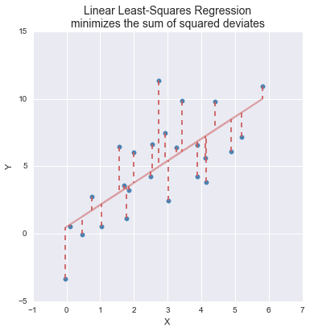
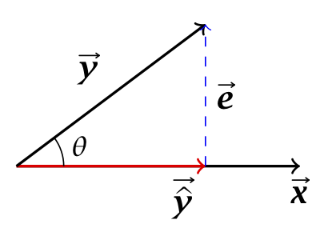

# Fitting Regression Models in R


Statistical models are quantitative statements about how we think variables are related to each other.  

Linear models are among the simplest statistical models.  In a linear model relating two variables $X$ and $Y$, the general form of the model can be stated as "I assume that $Y$ can be expressed as a linear function of $X$".  The process of *model fitting* is then the task of finding the coefficients (parameters) of the linear model which best fit the observed data.

Linear functions are those whose graphs are straight lines. A linear function of a variable $X$ is usually written as: 

$$
 \widehat{Y} = f(X) = a + bX
$$

where $a$ and $b$ are constants.  In  geometric terms $b$ is the *slope of the line* and $a$ is the value of the function when $X$ is zero (usually the referred to as the "Y-intercept"). The slope tells you have much $Y$ changes per unit change of $X$.

There are infinitely many such linear functions of $X$ we could define. Which linear function provides the best fit given our observed values of $X$ and $Y$?

## Regression terminology

- **Predictors, explanatory, or independent variable** -- the variables from which we want to make our prediction.

- **Outcomes, dependent, or response variable** -- the variable we are trying to predict in our regression.

## The optimality criterion for least-squares regression

In order to fit a model to data, we have to specify some criterion for judging how well alternate models perform.  

In linear regression, the optimality criterion can be expressed as "Find the linear function, $f(X)$, that minimizes the following quantity:"

$$
\sum (y_i - f(x_i))^2
$$
That is, our goal is to find the linear function of $X$ that minimizes the squared deviations in the $Y$ direction.

```{r, fig.align="center", out.width="40%", echo=FALSE, fig.cap = "A graphical representation of the optimality criterion in bivariate least squares linear regression."}

```

## Vector geometric perspective

The figure above illustrates the "variable space" view of linear regression. You've also been introduced to the "subject space" representation of regression, in which we can visualize regression as a projection operation.  

```{r, fig.align="center", out.width="40%", echo=FALSE, fig.cap = "A vector representation of bivariate linear regression."}

```

The least-squares optimality criterion is to find the vector $\vec{\widehat{Y}}$ that minimizes the residual vector $\vec{e}$.

## Solution for the least-squares criterion

With a little calculus and linear algebra one can show that the values of $b$ (slope) and $a$ (intercept) that minimize the sum of squared deviations described above are:


\begin{align}
b &= \frac{s_{xy}}{s^2_x} = r_{xy}\frac{s_y}{s_x}\\
\\
a &= \overline{Y} - b\overline{X}
\end{align}


where $r_{xy}$ is the correlation coefficient between $X$ and $Y$, and $s_x$ and $s_y$ are the standard deviations of $X$ and $Y$ respectively.

In vector geometric terms, we estimate the regression coefficient for mean centered vectors as:

$$
b = \frac{\vec{x} \cdot \vec{y}}{\vec{x} \cdot \vec{x}}
$$


## Libraries

```{r, warning=FALSE, message=FALSE}
library(tidyverse)
library(ggExtra)  # a new library, provides ggMarginal plot (see below)
                  # install if you don't already have it
```


## Illustrating linear regression with simulated data

To illustrate how regression works, we'll use a simulated data set where we specify the relationship between two variables, $X$ and $Y$.  Using a simulation is desirable  because  it allows us to know what the "true" underlying model that relates $X$ and $Y$ is, so we can evaluate how well we do in terms of recovering the model.

Let's generate two vectors representing the variable, $X$ and $Y$, where $Y$ is a function of $X$ plus some independent noise.  As specified below, the "true" model is $Y = 1.5X + 1.0 + \epsilon_y$ where $\epsilon_y$ is a noise term.

```{r}
# this seeds our random number generator
# by setting a seed, we can make random number generation reproducible
set.seed(20190227)  

npts <- 50
X <- seq(1, 5, length.out = npts) + rnorm(npts)
a <- 1.0
b <- 1.5
Y <- b*X + a + rnorm(npts, sd = 2)  # Y = 1.5X + 1.0 + noise

df.xy <- data.frame(X = X, Y = Y)
```

Having generated some simulated data, let's visualize it.

```{r}
p <- ggplot(df.xy, aes(x = X, y = Y)) + geom_point()
ggMarginal(p, type = "histogram", bins = 11)
```


## Specifying Regression Models in R

As one would expect, R has a built-in function for fitting linear regression models. The function `lm()` can be used not only to carry out bivariate linear regression but a wide range of linear models, including multiple regression, analysis of variance, analysis of covariance, and others.  

```{r}
fit.xy <- lm(Y ~ X, df.xy)
```

The first argument to `lm` is an R "formula", the second argument is a data frame.

Recall that formulas are R's way of specifying models, though they find other uses as well (e.g. we saw the formula syntax when we introduced the `facet_wrap` and `facet_grid` functions from ggplot, and in the context of ANOVA). The general form of a formula in R is `response variable ~ explanatory variables`.  In the code example above, we have only a single explanatory variable, and thus our response variable is Y and our explanatory variable is X.  

The `lm` function returns a list with a number of different components.  The ones of most interest to us are `fitted.values`, `coefficients`, `residuals`, and  (see the `lm` documentation for full details.)

```{r}
fit.xy
```

Calling `summary` on a fit model provides more detailed output:
```{r}
summary(fit.xy)
```

As we saw in previous R functions for implementing statistical test, the model object is actually a list-like object with multiple fields:

```{r}
typeof(fit.xy)

names(fit.xy)
```


### Fitted values

The component `fitted.values` gives the predicted values of $Y$ ($\hat{Y}$ in the equations above) for each observed value of $X$.  We can plot these predicted values of $Y$, as shown below. Notice how the predicted values all fall on a line (the regression line itself!)

```{r, fig.align="center", fig.cap="Observed (black) and predicted (red) values in a linear regression of Y on X.  Dashed lines indicate the residuals from the regression."}
ggplot(df.xy, aes(x = X, y = Y)) + 
  geom_point(alpha=0.7) +                           # observed data
  geom_point(aes(x = X, y = fit.xy$fitted.values),  # predicted data
             color='red', alpha=0.5) +
  geom_segment(aes(xend = X, yend = fit.xy$fitted.values),
               color='red', linetype='dashed', alpha=0.25)
  
```

### Getting the model coefficients

The `coefficients` components gives the value of the model parameters, namely the intercept and slope.

```{r, prompt=TRUE, collapse=TRUE, results='markup'}
fit.xy$coefficients
```

As shown above, the estimated slope is `r fit.xy$coefficients[[2]]` and the estimated intercept is `r fit.xy$coefficients[[1]]`.  The model estimated by our linear regression is thus $\widehat{Y} = 0.769 + 1.55X$.

Recall that because this is a synthetic example, we know the "true" underlying model, which is $Y = 1.5X + 1.0 + \epsilon_x$. On the face of it, it appears our regression model is doing a decent job of estimating the true model.

With this information in hand we can draw the regression line as so:

```{r}
ggplot(df.xy, aes(x = X, y = Y)) + 
  geom_point(alpha=0.7) +     # observed data
  geom_abline(slope = fit.xy$coefficients[[2]],
              intercept = fit.xy$coefficients[[1]],
              color='red', alpha=0.5)
```

Since linear model fitting is a fairly common task, the ggplot library includes a geometric mapping, `geom_smooth`, that will fit a linear model for us and generate the corresponding regression plot.

```{r}
ggplot(df.xy, aes(x = X, y = Y)) + 
  geom_point(alpha = 0.75) + 
  geom_smooth(method="lm", color = 'red')
```

By default, `geom_smooth` draws confidence intervals for the regression model (the shaded gray area around the regression line).  Note that confidence intervals for a linear regression model are wider far away from the mean values of $X$ and $Y$.

## Residuals

Residuals are the difference between the observed values of $Y$ and the predicted values.  You can think of residuals as the proportion of $Y$ unaccounted for by the model. 

$$
\mbox{residuals} = Y - \hat{Y}
$$

The previous figure showed the residuals as dashed lines connected the observed and predicted values.  A common way to depict the residuals, is to plot the predictor values versus the corresponding residual value, like so:

```{r}
ggplot(df.xy, aes(x = X)) +
  geom_point(aes(y = fit.xy$residuals)) + 
  geom_hline(yintercept = 0, color = 'red', linetype = "dashed") + 
  labs(x = "X", y = "Residuals")
```

When the linear regression model is appropriate, residuals should be normally distributed, centered around zero and should show no strong trends or extreme differences in spread (variance) for different values of $X$. 

## Regression as sum-of-squares decomposition

Regression can be viewed as a decomposition of the sum-of-squared deviations..

$$
ss(Y) = ss(\hat{Y}) + ss(\mbox{residuals})
$$

Let's check this for our example:

```{r, prompt=TRUE, collapse=TRUE, results='markup'}
ss.Y <- sum((Y - mean(Y))^2)
ss.Yhat <- sum((fit.xy$fitted.values - mean(Y))^2)
ss.residuals <- sum(fit.xy$residuals^2)
ss.Y
ss.Yhat + ss.residuals
```

## Variance "explained" by a regression model

We can use the sum-of-square decomposition to understand the relative proportion of variance "explained" (accounted for) by the regression model.

We call this quantity the "Coefficient of Determination",  designated $R^2$.  
$$
R^2 = \left( 1 - \frac{SS_{residuals}}{SS_{total}} \right)
$$

For this particular example we can estimate $R^2$ as follows:
```{r, results = "show"}
R2 <- 1.0 - (ss.residuals/ss.Y)
R2
```

In this particular example, we find our linear model accounts for about 63% of the variance in $Y$.  Note that the coefficient of determination is also reported when you apply the `summary` function to a linear model.

## Broom: a library for converting model results into data frames

The model fit object we got back when we used the `lm` function to carry out linear regression, carries lots of useful information it isn't a particularly "tidy" way to access the data.  The R package Broom converts "statistical analysis objects from R into tidy data frames, so that they can more easily be combined, reshaped and otherwise processed with tools like 'dplyr', 'tidyr' and 'ggplot2'.  The discussion of Broom below is drawn from the [Introduction to Broom](https://cran.r-project.org/web/packages/broom/vignettes/broom.html)

**If you haven't already done so, install the `broom` package before proceeding.**

```{r}
library(broom)
```

There are three `broom` functions that are particularly useful for our purposes. They are:

  1. `tidy` -- constructs a data frame that summarizes the model's statistical findings. 
  1. `augment` -- add columns to the original data that was modeled. This includes predictions, residuals, and cluster assignments.
  1. `glance` -- construct a concise one-row summary of the model. 
  

### `broom::tidy`

`tidy` applied to a regression model object returns a table giving the estimated coefficients and other information about the uncertainty of those estimates and corresponding p-values.  For now we're just interested in the estiamtes, the other values will  be described in detail when we get to statistical inference.

```{r}
tidy(fit.xy)
```

### `broom::augment`

`augment` creates a data frame that combines the original data with related information from the model fit.


```{r}
df.xy.augmented <- augment(fit.xy, df.xy)
head(df.xy.augmented)
```

Now, in addition to the `X` and `Y` variables of the original data, we have columns like `.fitted` (value of Y predicted by the model for the corresponding value of X), `.resid` (difference between the actual Y and the predicted value), and a variety of other information for evalulating model uncertainty. 

One thing we can do with this "augmented" data frame is to use it to better visualize and explore the model.  For example, if we wanted to generate a figure highlighting the deviations from the model using vertical lines emanating from the regression line, we could do something like this:

```{r}
ggplot(df.xy.augmented, aes(X, Y)) + 
  geom_point() + geom_smooth(method="lm", color="red",se=FALSE) +
  geom_segment(aes(xend = X, yend = .fitted), linetype="dashed")
```

An another example, we can recreate our residual plot using the augmented data frame as so:

```{r}
ggplot(df.xy.augmented, aes(X, .resid)) + 
  geom_point() + 
  geom_hline(yintercept = 0, color = "red", linetype='dashed') + 
  labs(y = "Residuals", title = "Residual plot for synthetic data example.")
```

### `broom::glance`

`glance()` provides  summary information about the goodness of fit of the model. Most relevant for our current discussion is the column giving the coefficient of determination (`r.squared`):

```{r}
glance(fit.xy)
```

## Example: Predicting lion age based on nose color

Having walked through a simulation example, let's now turn to a real world data set. A study by Whitman et al. (2004) showed that the amount of black coloring on the nose of male lions increases with age, and suggested that this might be used to estimate the age of unknown lions.  To establish the relationship between these variables they measured the black coloring on the noses of male lions of known age (represented as a proportion), giving the bivariate relationship (and fitted model) shown below:

```{r, message=FALSE}
lions <- read_csv("https://github.com/bio304-class/bio304-course-notes/raw/master/datasets/ABD-lion-noses.csv")

ggplot(lions, aes(x = proportionBlack, y = ageInYears)) + 
  geom_point() +
  geom_smooth(method="lm", color = 'red')
```

By eye, the linear model looks like a pretty good fit.  Let's take a look at the quantitative values of the regression model, using the various Broom functions to produce nice output.

```{r}
lion.model <- lm(ageInYears ~ proportionBlack, data = lions)
tidy(lion.model)
```

```{r}
glance(lion.model)
```

We then augment our data set with information from the model fit and plot a residual plot:

```{r}
lions.augmented <- augment(lion.model, lions)
ggplot(lions.augmented, aes(proportionBlack, .resid)) + 
  geom_point() + 
  geom_hline(yintercept = 0, color="firebrick", linetype="dashed")
```

From this plot, there may be some indication of greater variance of residuals for larger values of the predictor variable.

Let's check how normal the residuals look using a QQ-plot. Here we construct the QQ-plot using "standardized residuals" which are just z-scores for the residuals.

```{r}
ggplot(lions.augmented, aes(sample = .std.resid)) + 
  geom_qq() +
  geom_qq_line(color="firebrick")
```

Based on the QQ-plot, the residuals seem to diverge somewhat from a normal distirbution, as there's noticeable curvature in the QQ-plot.  When we test for the normality of the residuals using Shapiro-Wilk's test for normality, we fail to reject the null hypothesis of normality at a significance threshold of $\alpha=0.05$:

```{r}
shapiro.test(lions.augmented$.resid)
```

Even though we failed to reject the null hypothesis of normality for the residuals, but the P-value is very close to significance, suggesting some caution in applying the linear model.  
