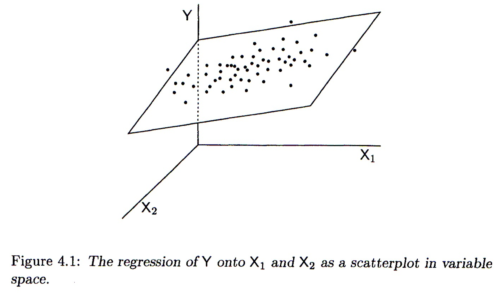

# Multiple regression

## Libraries to install 

We'll be using several new packages for this class session. Install the following packages via one of the standard install mechanisms:

* `HistData` -- provides the `GaltonFamilies` example data sets we'll work with
* `plot3D` -- for generating 3D plots
* `rgl` -- NOTE: On OS X, `rgl` requires you to install a program called XQuartz. XQuartz can be downloaded from the [XQuartz Home Page](https://www.xquartz.org). If you're on a Mac, install XQuartz before installing `rgl`. You may have to reboot your computer after installing XQuartz.


## Review of bivariate regression

Recall the model for bivariate least-squares regression. When we regress $Y$ and $X$ we're looking for a linear function, $f(X)$, for which the following sum-of-squared deviations is minimized:

$$
\sum_{i=1}^n (y_i - f(x_i))^2
$$

The general form a linear function of one variable is a line, 

$$
\widehat{Y} = f(x)  = a + bX
$$

where $b$ is the slope of the line and $a$ is the intercept.


## Multiple regression 

The idea behind multiple regression is almost exactly the same as bivariate regression, except now we try and fit a linear model for $Y$ using multiple explanatory variables, $X_1, X_2,\ldots, X_m$. That is we're looking for a linear function, $f(X_1, X_2,\ldots,X_m)$ that minimizes:

$$
\sum_{i=1}^n(y_i - f(x_1, x_2,\ldots, x_m))^2
$$

A linear function of more than one variable is written as:

$$
\widehat{Y} = f(X_1, X_2,\ldots,X_m) = a + b_1X_1 + b_2X_2 + \cdots + b_mX_m
$$

Where $a$ is the intercept and $b_1, b_2,\ldots,b_m$ are the **regression coefficients**. 


### Geometrical interpretation

Geometrically the regression coefficients have the same interpretation as in the bivariate case -- slopes with respect to the corresponding variable.  When there are two predictor variables, the linear regression is geometrically a plane in 3-space, as shown in the figure below.  When there are more than two predictor variables, the regression solution is a hyper-plane.




Mathematically, the best fitting regression coefficients, $b_1, b_2,\ldots,b_m$, are found using linear algebra.  Since we haven't covered linear algebra in this course, I will omit the details.  Conceptually the thing to remember is that the regression coefficients are related to the magnitude of the standard deviations of the the predictor variables and the covariances between the predictor and outcome variables.

### Coefficient of determination for multiple regression

As in bivariate regression, the coefficient of determination ($R^2$) provides a measure of the proportion of variance in the outcome variable ($Y$) "explained" by the predictor variables ($X_1, X_2, \ldots$).


## Interpretting Multiple Regression

Here are some things to keep in mind when interpretting a multple regression:

* In most cases of regression, causal interpretation of the model is not justified.

* Standard bivariate and multiple regression assumes that the predictor variables ( ($X_1, X_2, \ldots$) are observed without error. That is, uncertainty in the regression model is only associated with the outcome variable, not the predictors.

* Comparing the size of regression coefficients only makes sense if all the predictor (explanatory) variables have the same scale

* If the explanatory variables ($X_1, X_2,\ldots,X_m$) are highly correlated, then the regression solution can be "unstable" -- a small change in the data could lead to a large change in the regression model.


## Libaries

```{r, warning=FALSE, message=FALSE}
library(tidyverse)
library(cowplot)
library(broom)
library(GGally)
library(plot3D)
library(rgl)
```


## Example data set: `mtcars`

The `mtcars` dataset contains information on fuel consumption and ten other aspects of car design  (see `?mtcars` for more info). We'll use multiple regression to model the relationship between fuel consumption (`mpg`) and a vehicles weight (`wt`) and horsepower (`hp`).


## Visualizing and summarizing the variables of interest

Before carrying out any regression modle it's always a good idea to start out with visualizations of the individual variables first.

```{r, fig.width = 9, fig.height = 3}
hist.wt <- ggplot(mtcars, aes(wt)) + geom_histogram(bins=8)
hist.hp <- ggplot(mtcars, aes(hp)) + geom_histogram(bins=8)
hist.mpg <- ggplot(mtcars, aes(mpg)) + geom_histogram(bins=8)

plot_grid(hist.wt, hist.hp, hist.mpg, nrow = 1, labels = c("A", "B", "C"))
```

Let's also create some quick data summaries for our variables:

```{r}
mtcars.subset <- 
  mtcars %>%
  select(wt, hp, mpg)

summary(mtcars.subset)
```

And a correlation matrix to summarize the bivariate associations between the variables:

```{r}
cor(mtcars.subset)
```

We can use the `GGally::ggpairs()` function, which we've seen previously, to create a visualization of the bivariate relationships:

```{r}
ggpairs(mtcars.subset)
```

From the scatter plots and correlation matrix we see that weight and horsepower are positively correlated, but both are negatively correlated with fuel economy. This jives with our intuition -- bigger cars with more powerful engines generally get lower gas mileage.

## 3D plots 

Since we're building a model that involves three variables, it makes sense to look at at 3D plot. ggplot2 has no built in facilities for 3D scatter plots so we'll use a package called  [`plot3D`](http://www.rforscience.com/rpackages/visualisation/plot3d/). `plot3D` follows the plotting conventions of the base R-graphics capabilities, so we can't build up figures in layers in the same way we do in ggplot.  Instead we pass all the formatting arguments to a single function call.  

To create a 3D scatter plot we can use the `plot3D::points3D` function. The argument `pch` sets the type of plotting character to use in the plot (for a graphical key of the available plotting characters see [this link](https://www.statmethods.net/advgraphs/parameters.html)).

```{r, results = "hold"}
library(plot3D)

# create short variable names for convenience
wt <- mtcars$wt  
hp <- mtcars$hp
mpg <- mtcars$mpg

points3D(wt, hp, mpg,
         xlab = "Weight", ylab = "Horse Power", zlab = "MPG",
         pch = 20)  
```


We can change the angle of the 3D plot using the arguments `theta` and `phi` which change the "azimuthal direction" and "colatitude" (inclination angle). See the wikipedia page on [spherical coordinate systems](https://en.wikipedia.org/wiki/Spherical_coordinate_system) for more explanation of this values.

```{r}
points3D(wt, hp, mpg,
         xlab = "Weight", ylab = "Horse Power", zlab = "MPG",
         pch = 20,
         theta = 20, phi = 20  # these set viewing angle
)
```
          

If you want the points to have a uniform color specify a single color in the `col` argument.  Here we also add vertical lines to the plot using the `type` argument and show 

```{r}
points3D(wt, hp, mpg,
         xlab = "Weight", ylab = "Horse Power", zlab = "MPG",
         pch = 20,
         theta = 45, phi = 25,
         type = "h"
)
```

For more examples of how you can modify plots generated with the  `plot3D` package see [this web page](http://www.sthda.com/english/wiki/impressive-package-for-3d-and-4d-graph-r-software-and-data-visualization).


## Fitting a multiple regression model in R

Using the `lm()` function, fitting multiple regression models is a straightforward extension of fitting a bivariate regression model.

```{r, results = "markup"}
fit.mpg <- lm(mpg ~ wt + hp, data = mtcars.subset)
summary(fit.mpg)
```

As was the case for bivariate regression, the `broom` package functions `tidy`, `glance`, and `augment` can be useful for working with the results from fitting the mode.

```{r}
tidy(fit.mpg)
```

```{r}
glance(fit.mpg)
```

```{r}
mtcars.subset.augmented <-
  augment(fit.mpg, mtcars.subset)
```


## Visualizing the regression plane

For multiple regression on two predictor variables we can visualize the plane of best fit but adding it as a surface to our 3D plot.

```{r}
# Create a regular grid over the range of wt and hp values
grid.lines = 10

wt.grid <- seq(min(wt), max(wt), length.out = grid.lines)
hp.grid <- seq(min(hp), max(hp), length.out = grid.lines)
wthp.grid <- expand.grid(x = wt.grid, y = hp.grid)

grid.df <- data.frame(wt = wthp.grid[,1], hp = wthp.grid[,2])

# Predicted mpg at each point in grid
mpg.grid <- matrix(predict(fit.mpg, newdata = grid.df), 
                 nrow = grid.lines, ncol = grid.lines)

# Predicted mpg at observed 
mpg.predicted <- predict(fit.mpg)

# scatter plot with regression plane
points3D(wt, hp, mpg, 
    pch = 16, theta = 30, phi = 5, 
    col = "red", alpha=0.9,
    xlab = "Weight", ylab = "Horsepower", zlab = "MPG",  
    surf = list(x = wt.grid,
                y = hp.grid, 
                z = mpg.grid, 
                facets = NA, 
                fit = mpg.predicted,
                col = "black", alpha = 0.5)
    )
```


## Interactive 3D Visualizations Using OpenGL

The package `rgl` is another package that we can use for 3D visualization. `rgl` is powerful because it lets us create interactive plots we can rotate and zoom in/out on. 


Once you've installed and loaded `rgl` try the following code. 

```{r}
# create 3D scatter, using spheres to draw points
plot3d(wt, hp, mpg, 
       type = "s", 
       size = 1.5,
       col = "red")

# only need to include this line if using in a markdown document
rglwidget() 
```

We can add a 3d plane to our plot, representing the multiple regression model, with the `rgl.planes()` function as shown below.

```{r}
coefs <- coef(fit.mpg)
b1 <- coefs["wt"]
b2 <- coefs["hp"]
c <- -1
a <- coefs["(Intercept)"]
plot3d(wt, hp, mpg, 
       type = "s", 
       size = 1.5,
       col = "red")
rgl.planes(b1, b2, c, a, alpha = 0.9, color = "gray")
rglwidget()
```


## Examining the residuals

Residual plots are useful for multiple regression, just as they were for bivariate regression.

First we plot the residuals versus each of the predictor variable individually.

```{r, fig.width = 12, fig.height = 4}
wt.resids <-
  mtcars.subset.augmented %>%
  ggplot(aes(x = wt, y = .resid)) +
  geom_point() +
  geom_hline(yintercept = 0, linetype = 'dashed', color='red') + 
  labs(x = "Weight", y = "Residuals") 

hp.resids <-
  mtcars.subset.augmented %>%
  ggplot(aes(x = hp, y = .resid)) +
  geom_point() +
  geom_hline(yintercept = 0, linetype = 'dashed', color='red') + 
  labs(x = "Horsepower", y = "Residuals") 

plot_grid(wt.resids, hp.resids, labels=c("A", "B"))
```


And now we plot the residuals in 3D space, with a plane parallel to the xy-plane (wt, hp-plane) representing the plane about which the residuals should be homogeneously scattered if the assumptions of the linear regression model hold.

```{r} 
.resid <- mtcars.subset.augmented$.resid

# coefficients for plane perpindicular to 
# xy-axis intercepting the z-axis at 0
b1 <- 0
b2 <- 0
c <- -1
a <- 0

plot3d(wt, hp, .resid, 
       type = "s", 
       size = 1.5,
       col = "red",
       aspect = c(2,2,1))
rgl.planes(b1, b2, c, a, alpha = 0.9, color = "gray")
rglwidget()
```


