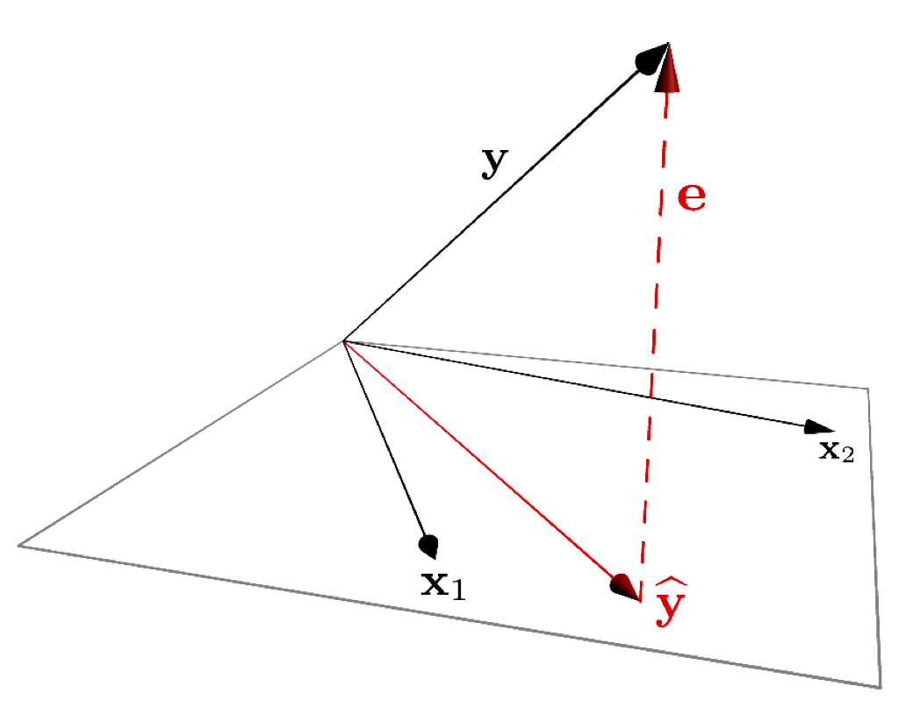

# Multiple Regression

## Review of bivariate regression

Recall the model for bivariate least-squares regression. When we regress $Y$ and $X$ we're looking for a linear function, $f(X)$, for which the following sum-of-squared deviations is minimized:

$$
\sum_{i=1}^n (y_i - f(x_i))^2
$$

The general form a linear function of one variable is a line, 

$$
\widehat{Y} = f(x)  = a + bX
$$

where $b$ is the slope of the line and $a$ is the intercept.


## Multiple regression 

The idea behind multiple regression is almost exactly the same as bivariate regression, except now we try and fit a linear model for $Y$ using multiple explanatory variables, $X_1, X_2,\ldots, X_m$. That is we're looking for a linear function, $f(X_1, X_2,\ldots,X_m)$ that minimizes:

$$
\sum_{i=1}^n(y_i - f(x_1, x_2,\ldots, x_m))^2
$$

A linear function of more than one variable is written as:

$$
\widehat{Y} = f(X_1, X_2,\ldots,X_m) = a + b_1X_1 + b_2X_2 + \cdots + b_mX_m
$$

Where $a$ is the intercept and $b_1, b_2,\ldots,b_m$ are the **regression coefficients**. 


### Variable space interpretation

Geometrically the regression coefficients have the same interpretation as in the bivariate case -- slopes with respect to the corresponding variable.  When there are two predictor variables, the linear regression is geometrically a plane in 3-space, as shown in the figure below.  When there are more than two predictor variables, the regression solution is a hyper-plane.


## Subject space representation

The subject space (vector geometric) representation of multiple regression is shown below:

```{r, fig.align="center", out.width="40%", echo=FALSE, fig.cap = "A vector representation of multiple regression."}

```

As was the case for bivariate regression, multiple regression is simply a projection operation.  


### Coefficient of determination for multiple regression

As in bivariate regression, the coefficient of determination ($R^2$) provides a measure of the proportion of variance in the outcome variable ($Y$) "explained" by the predictor variables ($X_1, X_2, \ldots$).


## Interpretting Multiple Regression

Here are some things to keep in mind when interpretting a multple regression:

* In most cases of regression, causal interpretation of the model is not justified.

* Standard bivariate and multiple regression assumes that the predictor variables ( ($X_1, X_2, \ldots$) are observed without error. That is, uncertainty in the regression model is only associated with the outcome variable, not the predictors.

* Comparing the size of regression coefficients only makes sense if all the predictor (explanatory) variables have the same scale

* If the explanatory variables ($X_1, X_2,\ldots,X_m$) are highly correlated, then the regression solution can be "unstable" -- a small change in the data could lead to a large change in the regression model.


## New Libraries to install

We'll be using several new packages for this class session. Install the following packages via one of the standard install mechanisms:

* `scatterplot3d`
* `rgl` -- NOTE: On OS X, `rgl` requires you to install a program called XQuartz. XQuartz can be downloaded from the [XQuartz Home Page](https://www.xquartz.org). If you're on a Mac, install XQuartz before installing `rgl`. You may have to reboot your computer after installing XQuartz.

## Libraries

```{r, warning=FALSE, message=FALSE}
library(tidyverse)
library(broom)  # for working w/lm output
```

## Examplar data

To illustrate multiple regression in R we'll use a built in dataset called `trees`. `trees` consists of measurements of the girth, height, and volume of 31 black cherry trees (`?trees` for more info). 

Let's assume we're lumberjacks, but our permit only allows us to harvest a fixed number of trees.  We get paid by the total volume of wood we harvest, so we're interested in predicting a tree's volume (hard to measure directly) as a function of its girth and height (relatively easy to measure), so we can pick the best trees to harvest.  We'll therefore calculate a multiple regression of volume on height and width.

## Data exploration

We'll start with some summary tables and diagnostic plots to familiarize ourselves with the data:

```{r, prompt=FALSE, collapse=TRUE, results='markup'}
names(trees)

dim(trees)

summary(trees)
```

We'll use the `GGally::ggpairs()` function introduced in problem set 01 to create a scatterplot matrix depicting the pairwise relationships between all the variables

```{r, warning=FALSE, message=FALSE}
library(GGally)
ggpairs(trees)
```


As one might expect for morphological measurements related to size, the scatterplot matrix shows that all the variables are positively correlated, and girth and volume have a  particularly strong correlation.

## 3D Plots

ggplot has no built in facilities for 3D scatter plots so we'll use two new packages,  [`scatterplot3D`](https://cran.r-project.org/package=scatterplot3d) and [`rgl`](https://cran.r-project.org/web/packages/rgl/vignettes/rgl.html), to generate 3D visualizations.

### scatterplot3d

```{r, warning=FALSE, message=FALSE}
library(scatterplot3d)  # install this package first if needed
scatterplot3d(trees,
              main = 'Tree Volume as\na function of Girth and Height')
```

The argument `pch` sets the type of plotting character to use in the plot (for a graphical key of the available plotting characters see [this link](https://www.statmethods.net/advgraphs/parameters.html)) and `color` sets plotting character colors. We can change the angle of the 3D plot using the `angle` argument:

```{r}
scatterplot3d(trees, 
              pch = 16, color="steelblue",
              angle=75,
              main = 'Tree Volume as\na function of Girth and Height')
```

We can add vertical lines to the plot using the `type` argument and remove the box around the plot:

```{r}
scatterplot3d(trees, 
              pch = 16, 
              color="steelblue",
              angle=75,
              box = FALSE,
              type = "h",
              main = 'Tree Volume as\na function of Girth and Height')
```

For more examples of how you can modify plots generated with the  `scatterplot3d` package see [this web page](http://www.sthda.com/english/wiki/scatterplot3d-3d-graphics-r-software-and-data-visualization#change-the-global-appearance-of-the-graph)).


### rgl

The package `rgl` is another package that we can use for 3D visualization. `rgl` is powerful because it lets us create interactive plots we can rotate and zoom in/out on. 

You can then create an interactive 3D plot as so:

```{r}
library(rgl)

# create 3D scatter, using spheres to draw points
plot3d(trees$Girth, trees$Height, trees$Volume,
      xlab = "Girth", ylab = "Height", zlab = "Volume",
       type = "s", 
       size = 1.5,
       col = "red")

rglwidget() # only need to include this line if using in a markdown document
```


## Fitting the regression model

From the 3D scatter plot it looks like we ought to be able to find a plane through the data that fits the scatter fairly well. 

Let's use the `lm()` function to calculate the multiple regression and `summary()` to get the details of the model:


```{r, prompt=FALSE, collapse=TRUE, results='markup'}
fit.trees <- lm(Volume ~ Girth + Height, data=trees)

summary(fit.trees)
```

### Visualizing the regression model in scatterplot3d

To visualize the multiple regression, let's use the `scatterplot3d` package to draw the 3D scatter of plots and the plane that corresponds to the regression model:

```{r}
p <- scatterplot3d(trees, angle=55,type='h',
                   pch = 16, color = "steelblue",
                   main = 'Tree Volume as\na function of Girth and Height')

# add a plane representing the fit of the model
p$plane3d(fit.trees, col='orangered')
```

If instead of `scatterplot3d`, we wanted to use `rgl` to depict the model fit we can use the `rgl.planes` function as shown below.

```{r, eval=FALSE}
coefs <- coef(fit.trees)
b1 <- coefs["Girth"]
b2 <- coefs["Height"]
c <- -1
a <- coefs["(Intercept)"]
plot3d(trees$Girth, trees$Height, trees$Volume,
      xlab = "Girth", ylab = "Height", zlab = "Volume", 
       type = "s", 
       size = 1.5,
       col = "red")
rgl.planes(b1, b2, c, a, alpha = 0.9, color = "gray")
rglwidget()
```


From the figures it looks like the regression model fits pretty well, as we anticipated  from the pairwise relationships.  

## Interpretting the regression model

The regression equation is: $\hat{y}$ = `r l$coefficients[[1]]` + `r l$coefficients[[2]]`$x_1$ +`r l$coefficients[[3]]`$x_2$, where $y$ is Volume, and $x_1$ and $x_2$ are Girth and Height respectively. Since they're on different scales the coefficients for Girth and Height aren't directly comparable. Both coefficients are significant at the $p<0.05$ level, but note that Girth is the much stronger predictor. In fact the addition of height explains only a minor additional fraction of variation in tree volume, so from the lumberjack's perspective the additional trouble of measuring height probably isn't worth it.

## Exploring the Vector Geometry of the Regression Model

The object returned by the `lm()` function hold lots of useful information:

```{r, prompt=FALSE, collapse=TRUE, results='markup'}
names(fit.trees)
```

The `fitted.values` correspond to the predicted values of the outcome variable ($\hat{y}$).  Alternate we can get this information in useful table form using functions from the `broom` library:

Recall the `broom:tidy` produces a tabular summary of the  coefficients of the model and their associated statistics:

```{r, prompt=FALSE, collapse=TRUE, results='markup'}
broom::tidy(fit.trees)
```

`broom:glance` provides information about the fit of the model:

```{r, prompt=FALSE, collapse=TRUE, results='markup'}
broom::glance(fit.trees)
```


Let's use our knowledge of vector geometry to further explore the relationship between the predicted Volume and the predictor variables.  By definition the vector representing the predicted values lies in the subspace (in this case a plane) defined by Height and Girth, so let's do some simple calculations to understand their length and angular relationships:

```{r, prompt=FALSE, collapse=TRUE, results='markup'}
# proportional to length of vectors
sd(fit.trees$fitted.values)
sd(trees$Height)
sd(trees$Girth)

# cosines of angles btw vectors
cor(trees$Height, trees$Girth)
cor(trees$Girth, fit.trees$fitted.values)
cor(trees$Height, fit.trees$fitted.values)

# angles btw vectors in degrees
acos(cor(trees$Girth, trees$Height)) * (180/pi)
acos(cor(trees$Girth, fit.trees$fitted.values)) * (180/pi)
acos(cor(trees$Height, fit.trees$fitted.values)) * (180/pi)
```


## Exploring the Residuals from the Model Fit

Now let's look at the residuals from the regression. The residuals represent the `unexplained' variance:

```{r}
trees.augmented <- augment(fit.trees, trees)

ggplot(trees.augmented, aes(x = Girth, y = .resid)) + 
  geom_point() + 
  geom_hline(yintercept = 0, color='red', linetype='dashed') +
  labs(x = "Girth", y = "Residuals")

```

Ideally the residuals should be evenly scattered around zero, with no trends as we go from high to low values of the dependent variable.  As you can see, the residuals are somewhat u-shaped or j-shaped suggesting that there may be a non-linear aspect of the relationship that our model isn't capturing.

## An alternate model

Let's think about the relationships we're actually modeling for a few minutes.  For the sake of simplicity let's consider the trunk of a tree to be a cylinder.  How do the dimensions of this cylinder relate to its volume? You can look up the formula for the volume of a cylinder, but the key thing you'll want to note is that volume of the cylinder should be proportional to a characteristic length of the cylinder cubed ($V \propto \mathrm{L}^3$). This suggests that if we want to fit a linear model we should relate Girth and Height to $\sqrt[3]{\mathrm{Volume}}$:

```{r, prompt=FALSE, collapse=TRUE, results='markup'}
trees.cuberoot <- mutate(trees, cuberoot.Volume = Volume^0.33)

fit.trees.cuberoot <- lm(cuberoot.Volume ~ Girth + Height, data = trees.cuberoot)

broom::glance(fit.trees) # summary of fit of original model

broom::glance(fit.trees.cuberoot)  # summary of fit of alternate model
```

Comparing the summary tables, we see indeed that using the cube root of Volume improves the fit of our model some. Let's examine the residuals of this alternate model.

```{r}
trees.cuberoot <- broom::augment(fit.trees.cuberoot, trees.cuberoot)

ggplot(trees.cuberoot, aes(x = cuberoot.Volume, y = .resid)) + 
  geom_point() + 
  geom_hline(yintercept = 0, color='red', linetype='dashed') +
  labs(x = "Girth", y = "Residuals")
```

As we can see the transformation we applied to the data did seem to make our residuals more uniform across the range of observations. 

## Fitting a curvilinear model using lm()

Above we transformed the volume data in order to fit a straight line relationship between $\sqrt[3]{V}$  and Girth and Hieght. However, we could just as easily have applied a cubic regression to the original variables (remember this is still linear in the coefficients). Since Height didn't add much to additional information, we'll simplify the model to consider only Girth.

```{r, prompt=FALSE, collapse=TRUE, results='markup'}
fit.curvilinear <- lm(Volume ~ I(Girth^3), data=trees)

broom::tidy(fit.curvilinear)

broom::glance(fit.curvilinear)
```

Here's how we can visualize the corresponding curvilinear regression using ggplot:

```{r}
ggplot(trees, aes(x = Girth, y = Volume)) + 
  geom_point() + 
  geom_smooth(method = "lm", 
              formula = y ~ I(x^3),
              se = FALSE)
```


The `I()` function used above requires a little explanation.  Normally, the R formula syntax (see `?formula`) treats the carat symbol, `^`, as short-hand for factor crossing to the specified degree.  For example, the formula `(a+b+c)^2` would be interpretted as the model with main effects and all second order interaction terms, i.e. `a + b + c + a:b + a:c + b:c` where the colons indicate interactions.  The `I()` function `protects' the object in it's argument; in this case telling the regression function to treat this as Girth raised to the third power as opposed to trying to construct interaction terms for Girth.


## Exploring the impact of nearly collinear predictors on regression

In lecture we discussed the problems that can arise in regression when your predictor variables are nearly collinear. In this section we'll illustrate some of these issues.

Consider again the `trees` data set.  Recall that two of the variables -- Girth and Volume -- are highly correlated and thus nearly collinear.

```{r, prompt=FALSE, collapse=TRUE, results='markup'}
cor(trees)
```

Let's explore what happens when we treat Height as the dependent variable, and Girth and Volume as the predictor variables.

```{r, prompt=FALSE, collapse=TRUE, results='markup'}
fit.Height <- lm(Height ~ Girth + Volume, data = trees)

broom::glance(fit.Height)
```

We can, of course, fit the linear model despite the near collinearity, and we find that the model does have some predictive power, with $R^2 = 0.41$, and with Volume being the more significant predictor.

Now, let's created a slightly different version of the trees data set by add some noise to the three variables.   Our goal here is to simulate a data set we might have created had we measured a slightly different set of trees during our sampling. We'll use the `jitter()` function to add uniform noise to the data set.

```{r}
jitter.Girth <- jitter(trees$Girth, amount= 0.5 * sd(trees$Girth))
jitter.Height <- jitter(trees$Height, amount= 0.5 * sd(trees$Height))
jitter.Volume <- jitter(trees$Volume, amount= 0.5 * sd(trees$Volume))
jitter.trees <- data.frame(Girth = jitter.Girth, 
                        Height = jitter.Height, 
                        Volume = jitter.Volume)
```

Here we added uniform noise proportional to the one-quarter the standard deviation of each variable.  Let's take a moment to convince ourselves that our new data set, `jitter.trees`, is not too different from the `trees` data set from which it was derived.

```{r, prompt=FALSE, collapse=TRUE, results='markup'}
set.seed(20190227)

# compare this to broom::tidy(trees)
broom::tidy(jitter.trees)

# correlations among jittered variables are
# similar to those of the original variables
cor(jitter.trees)

## jittered variables are highly correlatd with original variables
cor(trees$Height, jitter.trees$Height)
cor(trees$Girth, jitter.trees$Girth)
cor(trees$Volume, jitter.trees$Volume)
```

Now that we've convinced ourselves that our jittered data set is a decent approximation to our original data set, let's re-calculate the linear regression, and compare the coefficients of the jittered model to the original model:

```{r, prompt=FALSE, collapse=TRUE, results='markup'}
fit.Height.jitter <- lm(Height ~ Girth + Volume, data = jitter.trees)

broom::tidy(fit.Height)

broom::tidy(fit.Height.jitter)
```

We see that the coefficients of the linear model have changed substantially between the original data and the jittered data.  Our model is unstable to relatively modest changes to the data!

Let's  draw some plots to illustrate how different the models fit to the original and jittered data are:

```{r}
# draw 3d scatter plots with small points so as not to obscure regression planes
p <- scatterplot3d(x=trees$Girth, y=trees$Volume, z=trees$Height, 
                      angle=15, type='p', pch='.')

# original model
p$plane3d(fit.Height, col='orangered')

# jittered model
p$plane3d(fit.Height.jitter, col='blue')
```

Let's do the same comparison for the multiple regression of Volume on Height and Girth.  In this case the predictor variables are \emph{not} nearly collinear.

```{r, prompt=FALSE, collapse=TRUE, results='markup'}
fit.Volume <- lm(Volume ~ Girth + Height, data = trees)
fit.Volume.jitter <- lm(Volume ~ Girth + Height, data = jitter.trees)

coefficients(fit.Volume)

coefficients(fit.Volume.jitter)
```

For this model, we see that the coefficients have changed only a small amount.  The underlying data, `jitter.trees`, is the same in both cases, but now our model is stable because the predictor variables are only modestly correlated with each other.

Let's generate another plot to illustrate the similarity of the models fit to the original and jittered data when Girth and Height are used to predict Volume.

```{r}
p <- scatterplot3d(x=trees$Girth, y=trees$Height, z=trees$Volume, 
                     angle=55, type='p', pch='.')
p$plane3d(fit.Volume, col='orangered')
p$plane3d(fit.Volume.jitter, col='blue')
```

Finally, let's do some vector calculations to quantify how the angular deviation between the fit data and the predictor variables changes between the original and jittered data set for the two different multiple regressions:

```{r, prompt=FALSE, collapse=TRUE, results='markup'}
# write a quickie fxn to express angle between vectors in degrees
vec.angle <- function(x,y) { acos(cor(x,y)) * (180/pi)}

# vector angles for fit of Height ~ Girth + Volume (orig)
vec.angle(fit.Height$fitted.values, trees$Girth)
vec.angle(fit.Height$fitted.values, trees$Volume)

# vector angles for fit of Height ~ Girth + Volume (jittered)
vec.angle(fit.Height.jitter$fitted.values, jitter.trees$Girth)
vec.angle(fit.Height.jitter$fitted.values, jitter.trees$Volume)
```

Now the same comparison for the non-collinear model `Volume ~ Girth + Height`.

```{r, prompt=FALSE, collapse=TRUE, results='markup'}
# vector angles for fit of Volume ~ Girth + Height (orig)
vec.angle(fit.Volume$fitted.values, trees$Girth)
vec.angle(fit.Volume$fitted.values, trees$Height)

# vector angles for fit of Volume ~ Girth + Height (jittered)
vec.angle(fit.Volume.jitter$fitted.values, jitter.trees$Girth)
vec.angle(fit.Volume.jitter$fitted.values, jitter.trees$Height)
```

As these calculation illustrate, the change in the regression plane in the jittered date is much smaller when the dependent variable are not nearly colinear.

## LOESS Models

LOESS (aka LOWESS; ‘Locally weighted scatterplot smoothing’) is a
modeling technique that fits a curve (or surface) to a set of data using
a large number of local regressions. Local weighted regressions are fit
at numerous regions across the data range, using a weighting function
that drops off as you move away from the center of the fitting region
(hence the "local aspect). LOESS combines the simplicity of least
squares fitting with the flexibility of non-linear techniques and
doesn’t require the user to specify a functional form ahead of time in
order to fit the model. It does however require relatively dense
sampling in order to produce robust fits.

Formally, at each point $x_i$ we estimate the regression coefficients
$\hat{\beta}_j(x)$ as the values that minimize:
$$
\sum_{k=1}^n w_k(x_i)(y_k - \beta_0 - \beta_1 x_k - \ldots - \beta_d x_k^2)^2
$$
where $d$ is the degree of the polynomial (usually 1 or 2) and $w_k$
is a weight function. The most common choice of weighting function is
called the "tri-cube" function as is defined as: 

\[w(x) = (1-|x|^3)^3, \mbox{for}\ |x| \lt 1\]

\[= 0, \mbox{for}\ |x| \geq 1\]


The primary parameter that a user must decide on when using LOESS is the
size of the neighborhood function to apply (i.e. over what distance
should the weight function drop to zero). This is referred to as the
"span" in the R documentation, or as the parameter $\alpha$ in many of
the papers that discuss LOESS. The appropriate span can be determined by
experimentation or, more rigorously by cross-validation.

We’ll illustrate fitting a Loess model using data on Barack Obama’s approval ratings over the period from 2008 to 2001 ([`obama-polls.txt`](https://github.com/Bio723-class/example-datasets/raw/master/obama-polls-2008-2011.txt)).

```{r, message=FALSE}
polls <- read_delim('https://github.com/Bio723-class/example-datasets/raw/master/obama-polls-2008-2011.txt',
                    delim="\t", trim_ws=TRUE)
# note that we needed to use "trim_ws" above because there were 
# some lurking spaces in the fields of that tab delimited data file

head(polls)
```


```{r}
polls <-
  polls %>%
  mutate(pollnum = rev(1:length(Approve)))

ggplot(polls, aes(x = pollnum, y = Approve)) + 
  geom_point()
```

We can fit the LOESS as so:
```{r}
loess.approval <- loess(Approve ~ pollnum, data = polls)
summary(loess.approval)
```

Let's draw the loess in ggplot:

```{r}
ggplot(polls, aes(x = pollnum, y = Approve)) + 
  geom_point(alpha=0.5) +
  geom_smooth(color='red', method="loess")
```

