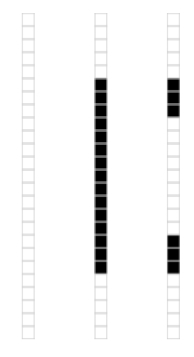

# Singular Value Decomposition

## Libraries

```{r, message=FALSE, warning=FALSE}
library(tidyverse)
library(stringr)
library(broom)
library(GGally)
library(cowplot)
```


## SVD in R

$$\newcommand{\Mtx}[1]{\mathbf{#1}}$$

If $\Mtx{x}$ is an $n \times p$ matrix, and the singular value decomposition of $\Mtx{A}$ is given by $\Mtx{A} = \Mtx{U} \Mtx{S} \Mtx{V}^T$, the columns of the  matrix $\Mtx{V}^T$ are the eigenvectors of the square matrix $\Mtx{A}^T \Mtx{A}$ (sometimes refered to  as the minor product of \Mtx{A}). The singular values of \Mtx{A} are equal to the square roots of the eigenvalues of $\Mtx{A}^T \Mtx{A}$.

The `svd()` function computes the singular value decomposition of an arbitrary rectangular matrix. Below I demonstrate the use of the `svd()` function and confirm the relationships described above:

```{r}
A <- matrix(c(2,1,2,3),nrow=2)
A
a.svd <- svd(A)
# R uses the notation A = u d v' rather than A = u s v'
a.svd$u
a.svd$d
a.svd$v
```

We should be able to reconstruct $\Mtx{A}$ from the SVD:
```{r}
all.equal(A, a.svd$u %*% diag(a.svd$d) %*% t(a.svd$v))
```


We can also demonstrate the relationship between the SVD of $\Mtx{A}$ and the eigendecomposition of $\Mtx{A}^T\Mtx{A}$:
```{r}
AtA <- t(A) %*% A
eigen.AtA <- eigen(AtA)
all.equal(a.svd$d, sqrt(eigen.AtA$values))
```

As we discussed in lecture, the eigenvectors of square matrix, $\Mtx{A}$, point in the directions that are unchanged by the transformation specified by $\Mtx{A}$.


## Writing our own PCA function using SVD

In lecture we discussed the relationship between SVD and PCA.  Let's walk through some code that carries out PCA via SVD, and then we'll implement our own PCA function.

```{r}
iris.numeric <- select(iris, select=-Species)
iris.ctrd <- scale(iris.numeric, center=TRUE, scale=FALSE)
iris.svd <- svd(iris.ctrd)

U <- iris.svd$u
S <- diag(iris.svd$d)
V <- iris.svd$v

pc.scores <- U %*% S
colnames(pc.scores) <- str_c("PC", 1:ncol(pc.scores))

pc.scores.df <- as.data.frame(pc.scores)
pc.scores.df <- 
  pc.scores.df %>%
  mutate(Species = iris$Species)

ggplot(pc.scores.df, aes(PC1, PC2, color=Species)) + 
  geom_point() + 
  coord_fixed(ratio=1)

```

```{r}
n <- nrow(iris.ctrd)
pc.sdev <- sqrt((S**2/(n-1)))
pc.sdev
V
```

For comparison, here's what the builtin `prcomp()` function gives us:

```{r}
iris.pca <- prcomp(iris.ctrd)
iris.pca$sdev
iris.pca$rotation
```

Now that we have a sense of the key calculations, let's turn this into a function. 

```{r}
# a user defined version of principal components analysis
PCA <- function(X, center=TRUE, scale=FALSE){
   x <- scale(X, center=center, scale=scale)
   n <- nrow(x)
   p <- ncol(x)

   x.svd <- svd(x)
   U <- x.svd$u
   S <- diag(x.svd$d)
   V <- x.svd$v

   # check for zero eigenvalues
   tolerance = .Machine$double.eps^0.5
   has.zero.singval <- any(x.svd$d <= tolerance)
   if(has.zero.singval)
     print("WARNING: Zero singular values detected")

   pc.scores <- U %*% S
   colnames(pc.scores) <- str_c("PC", 1:ncol(pc.scores))
   pc.sdev <- diag(sqrt((S**2/(n-1))))
   return(list(vectors = V, scores=pc.scores, sdev = pc.sdev))
}
```

Note I also included some code to warn the user when the covariance matrix is singular. Use the help to read about variables defined in `.Machine`.

Let's put our function through its paces:

```{r}
iris.pca <- PCA(iris.numeric)
ggplot(as.data.frame(iris.pca$scores), aes(x = PC1, y = PC2)) + 
  geom_point() + 
  coord_fixed(ratio=1)
```


```{r}
# flip the rows and columns of i.sub and do PCA
 # Our function should detect singular values equal to zero. Why?
singular.pca <- PCA(t(iris.numeric)) 
```

```{r}
tree.pca <- PCA(trees)
tree.pca$sdev

# compare to prcomp
prcomp(trees)$sdev 
```


To bring things full circle, let's make sure that the covariance matrix we reconstruct from our PCA analysis is equal to the covariance matrix calculated directly from the data set:

```{r}
n <- nrow(iris.numeric)
V <- iris.pca$vectors
S <- diag( sqrt(iris.pca$sdev**2 * (n-1)) ) # turn sdev's back into singular values
reconstructed.cov <- (1/(n-1)) * V %*% S %*% S %*% t(V) # see pg. 11 of slides
all.equal(reconstructed.cov, cov(iris.numeric), check.attributes=FALSE)
```

Great! It seems like things are working as expected.

## Writing a biplot function

We can use the same basic framework above to create a function to compute a biplot for our PCA.  The function below includes an argument `emphasize.variables`, If `emphasize.variables` is `TRUE`, the function returns the biplot corresponding to $\alpha=0$, the column-metric preserving biplot.  If this arugment is `FALSE` it returns calculations correspoding to $\alpha=1$, the row-metric preserving biplot.

```{r}
# a user defined version of principal components analysis
PCA.biplot <- function(X, center=TRUE, scale=FALSE, emphasize.variables=TRUE){
  x <- scale(X, center=center, scale=scale)
  n <- nrow(x)
  p <- ncol(x)
  
  x.svd <- svd(x)
  U <- (x.svd$u)[,1:2]
  S <- diag(x.svd$d[1:2])
  V <- x.svd$v[,1:2]
  
  if (emphasize.variables) {
    biplot.scores <- sqrt(n) * U
    biplot.vectors <- (1/sqrt(n)) * V %*% S
  } else {
    biplot.scores <- U %*% S
    biplot.vectors <- V
  }
  colnames(biplot.scores) <- str_c("PC", 1:ncol(biplot.scores)) 
  colnames(biplot.vectors) <- str_c("PC", 1:ncol(biplot.vectors))
  rownames(biplot.vectors) <- colnames(X)
  
  list(scores=as.data.frame(biplot.scores),
       vectors=as.data.frame(biplot.vectors) %>% mutate(Variable = colnames(X)))
}
```

Let's first create a biplot that emphasize the relationships between the variables.

```{r, fig.width=6, fig.height=6}
iris.biplot.var <- PCA.biplot(iris.numeric, emphasize.variables = TRUE)

small.arrow = arrow(angle = 15, length = unit(0.15, "inches"))

p1 <-
  ggplot() + 
  geom_point(data=iris.biplot.var$scores %>% mutate(Species = iris$Species), 
             mapping=aes(x=PC1, y=PC2, color=Species)) +
  geom_segment(data=iris.biplot.var$vectors, 
               mapping=aes(x=0, y=0, xend=PC1, yend=PC2),
               arrow=small.arrow, color='red') + 
  geom_text(data=iris.biplot.var$vectors,
            mapping=aes(x=PC1 * 1.1, y=PC2*1.1, label=Variable),
            color='red') + 
  coord_fixed()

p1
```

The biplot we just created emphasizes information about the variables in our data, and their relationship to each other and the principal components.  Notice that the angule beween Petal Width and Petal Length is very small -- this indicates they are highly correlated, while Sepal Width is nearly uncorrelated with the previous two variables.  Petal Width and Petal Length also approximately parallel to PC1, indicating that they have large loadings with the first PC.    The Petal Length vector is the longest indicating that it has the largest standard deviation.  This biplot however distorts the relationships among the objects (observations) -- the scatter of scores in this biplot is not an optimal representation of the true distances between the observations in the original space.


Now we create a biplot that emphasizes the relationships between the objects.

```{r, fig.width=10, fig.height=8}
iris.biplot.obj <- PCA.biplot(iris.numeric, emphasize.variables = FALSE)
p2 <-
  ggplot() + 
  geom_point(data=iris.biplot.obj$scores %>% mutate(Species = iris$Species), 
             mapping=aes(x=PC1, y=PC2, color=Species)) +
  geom_segment(data=iris.biplot.obj$vectors, 
               mapping=aes(x=0, y=0, xend=PC1, yend=PC2),
               arrow=small.arrow, color='red') + 
  geom_text(data=iris.biplot.obj$vectors,
            mapping=aes(x=PC1 * 1.1, y=PC2*1.1, label=Variable),
            color='red') +   
  coord_fixed()
p2
```

In this view, the points representing the weighted scores are a better representation of the relationships among the observations, but the geometry of the vectors representing the associations among the variables is no longer optimal.  


## Data compression and noise filtering using SVD

Two common uses for singular value decomposition are for data compression and noise filtering. We'll illustrate these with two examples involving matrices which represent image data. This example is drawn from an article by David Austin, found on a [tutorial about SVD at the American Mathematical Society Website](http://www.ams.org/samplings/feature-column/fcarc-svd).

### Example image

The file [`zeros.dat`](https://github.com/pmagwene/Bio723/raw/master/datasets/zero.dat) from the course wiki. This is a $25 \times 15$ binary matrix that represents pixel values in a simple binary (black-and-white) image.

```{r, message=FALSE}
zero <- read_tsv('https://github.com/pmagwene/Bio723/raw/master/datasets/zero.dat', col_names=FALSE)
head(zero)
```

```{r, fig.width=4}
# we'll use the image() function to visualize the matrix
x <- 1:15
y <- 1:25
image(x, y, t(zero), 
      xlim=c(1,15), ylim=c(1,25), col=c('black','white'),asp=1)
```


This data matrix can be thought of as being composed of just three types of vectors, each illustrated in the following figure:



If SVD is working like expected it should capture that feature of our input matrix, and we should be able to represent the entire image using just three singular values and their associated left- and right-singular vectors.

```{r}
zero.svd <- svd(zero)
round(zero.svd$d,2)
```

```{r}
D <- diag(zero.svd$d[1:3])
U <- zero.svd$u[,1:3]
V <- zero.svd$v[,1:3]
new.zero <- U %*% D %*% t(V)
all.equal(new.zero, as.matrix(zero), check.attributes=FALSE)
```

```{r, fig.width=4}
# and let's double check using the image() function
image(x, y, t(new.zero),
      asp=1,xlim=c(1,15),ylim=c(1,25), col=c('black','white'))
```

Our original matrix required $25 \times 15$ ($= 375$) storage elements. Using the SVD we can represent the same data using only $15 \times 3 + 25 \times 3 + 3 = 123$ units of storage (corresponding to the truncated U, V, and D in the example above). Thus our SVD allows us to represent the same data with at less than $1/3$ the size of the original matrix. In this case, because all the singular values after the 3rd were zero this is a lossless data compression procedure.


\subsection{Noise filtering using SVD}

The file [`noisy-zero.dat`](https://raw.githubusercontent.com/pmagwene/Bio723/master/datasets/noisy-zero.dat) is the same 'zero' image, but now sprinkled with Gaussian noise draw from a normal distribution $N(0,0.1)$. As in the data compression case we can use SVD to approximate the input matrix with a lower-dimensional approximation. Here the SVD is "lossy"" as our approximation throws away information.  In this case we hope to choose the approximating dimension such that the information we lose corresponds to the noise which is "polluting"" our data.

```{r, fig.width=4, message=FALSE}
noisy.zero <- read_tsv('https://raw.githubusercontent.com/pmagwene/Bio723/master/datasets/noisy-zero.dat',col_names = FALSE)
x <- 1:15
y <- 1:25
# create a gray-scale representation of the matrix
image(x, y, t(noisy.zero), asp=1, 
      xlim=c(1,15), ylim=c(1,25), col=gray(seq(0,1,0.05)))
```

Now we carry out SVD of the matrix representing this noisy image:

```{r}
noisy.svd <- svd(noisy.zero)

# as before the first three singular values dominate
round(noisy.svd$d,2)

nD <- diag(noisy.svd$d[1:3])
nU <- noisy.svd$u[,1:3]
nV <- noisy.svd$v[,1:3]
approx.noisy.zero <- nU %*% nD %*% t(nV)
```

Finally we plot the approximation of this image based on the first three singular vectors/values:
```{r}
# now plot the original and approximating matrix side-by-side
par(mfrow=c(1,2))
image(x, y, t(noisy.zero),
      asp=1,xlim=c(1,15),ylim=c(1,25),col=gray(seq(0,1,0.05)))
image(x, y, t(approx.noisy.zero),
      asp=1,xlim=c(1,15),ylim=c(1,25),col=gray(seq(0,1,0.05)))
```

As you can see from the images you created the approximation based on the approximation based on the SVD manages to capture the major features of the matrix and filters out much of (but not all) the noise.

## Image compression using SVD in R

We'll illustrate another application of SVD -- approximating a high dimensional data set using a lower dimensional approximation.  We'll apply this concept to image compression.

R doesn't have native support for common image files like JPEG and PNG.  However, there are packages we can install that will allow us to read in such files and treat them as matrices.  We'll use a package called ["imager"](https://cran.r-project.org/web/packages/imager/vignettes/gettingstarted.html) to work with images.

**Install the "imager" library via the standard installation mechanism**

Once imager is installed, download this [picture of my dog Chester](https://raw.githubusercontent.com/pmagwene/Bio723/master/datasets/chesterbw.jpg) to your local filesystem and load it as follows:


```{r, fig.width=6, fig.height=6, message=FALSE}
library(imager)
# change the path to match the location you've downloaded the iamge
chester <- load.image("~/Downloads/chesterbw.jpg")
```

We can plot images loaded by imager

```{r, fig.width=6, fig.height=6}
plot(chester)
```


Let's explore the object returned by imager:

```{r}
dim(chester)
typeof(chester)
class(chester)
```

imager stores the image information in a multidimensional array that has a class of "cimg" (type `?cimg`).  To manipulate this information using SVD we'll need to turn it into a conventional matrix first.

```{r}
chester.matrix <- as.matrix(chester)
```

Now we'll use SVD to create a low-dimensional approximation of this image.

```{r, fig.width=6, fig.height=6}
img.svd <- svd(chester)
U <- img.svd$u
S <- diag(img.svd$d)
Vt <- t(img.svd$v)

U15 <- U[,1:15]  # first 15 left singular vectors
S15 <- S[1:15,1:15]  # first 15 singular values
Vt15 <- Vt[1:15,]  # first 15 right singular values, NOTE: we're getting rows rather than columns here

approx15 <- U15 %*% S15 %*% Vt15
plot(as.cimg(approx15))  # to plot the matrix as an image we cast it back to a cimg
```


Above we created a rank 15 approximation to the rank 556 original image matrix. This approximation is crude (as judged by the visual quality of the approximating image) but it does represent a very large savings in space. Our original image required the storage of $605 \times 556 = 336380$ integer values. Our approximation requires the storage of only $15 \times 556 + 15 \times 605 + 15 = 17430$ integers. This is a saving of roughly 95%. Of course, as with any lossy compression algorithm, you need to decide what is the appropriate tradeoff between compression and data loss for your given application.

Finally, let's look at the "error term" associated with our approximation, i.e. what we *did not* capture in the 15 singular vectors.

```{r, fig.width=6, fig.height=6}
img.diff <- chester.matrix - approx15
nr <- nrow(img.diff)
nc <- ncol(img.diff)
plot(as.cimg(img.diff))
```

