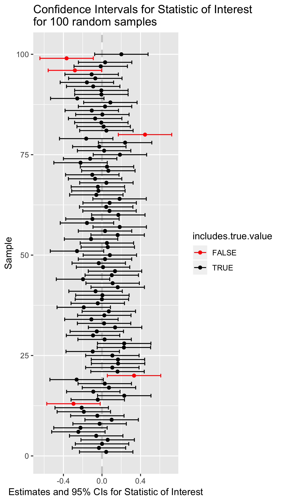

# Simulating confidence intervals


Recall the concept of the **sampling distribution of a statistic** -- this is simply the probability distribution of the statistic of interest you would observe if you took a large number of random samples of a given size from a population of interest and calculated that statistic for each of the samples. 

You learned that the standard deviation of the sampling distribution of a statistic has a special name -- the **standard error** of that statistic.  The standard error of a statistic provides a way to quantify the uncertainty of a statistic across random samples.   Here we show how to use information about the standard error of a statistic to calculate plausible ranges for a statistic of interest that take into account the uncertainty of our estimates.  We call such plausible ranges **Confidence Intervals**.


## Confidence intervals

We know that given a random sample from a population of interest, the value of a statistic of interest is unlikely to be exactly equally to the true population value of that statistic.  However, our simulations have taught us a number of things:

  1. As sample size increases, the *sample estimate* of the given statistic is more likely to be close to the true value of that statistic
  
  2. As sample size increases, the standard error of the statistic decreases

We will define an "X% percent confidence interval for a statistic of interest", as an interval (upper and lower bound) that when calculated from a random sample, would include the true population value of the statistic of interest, X% of the time.

 This quote from the [NIST page on confidence intervals](http://www.itl.nist.gov/div898/handbook/eda/section3/eda352.htm), which I've adapted to refer to any statistic, helps to make this concrete regarding confidence intervals:

> As a technical note, a 95% confidence interval does not mean that there is a 95% probability that the interval contains the true [statistic]. The interval computed from a given sample either contains the true [statistic] or it does not. Instead, **the level of confidence is associated with the method of calculating the interval** ... That is, for a 95% confidence interval, if many samples are collected and the confidence interval computed, in the long run about 95% of these intervals would contain the true [statistic].

The idea behind a 95% confidence interval is illustrated in the following figure:

```{r, echo = FALSE, out.width = "60%", fig.align = "center", fig.cap = "Point estimates and confidence intervals for a theoretical statistic of interest.", results="markup"}

```

## Generic formulation for confidence intervals

We define the $(100\times\beta)$% confidence interval for the statistic $\phi$ as the interval:

\[
CI_\beta = \phi_{n} \pm (z \times {SE}_{\phi,n})
\]

Where:

* $\phi_{n}$ is the statistic of interest in a random sample of size $n$
* ${SE}_{\phi,n}$ is the standard error of the statistic $\phi$ (via simulation or analytical solution)

And the value of $z$ is chosen so that:

* across many different random samples of size $n$, the true value of the $\phi$ in the population of interest would fall within the interval approximately $(100\times\beta)$% of the time

So rather than estimating a single value of $\phi$ from our data, we will use our observed data plus knowledge about the sampling distribution of $\phi$ to estimate a range of plausible values for $\phi$. The size of this interval will be chosen so that if we considered many possible random samples, the true population value of $\phi$ would be bracketed by the interval in $(100\times\beta)$%  of the samples.

## Example: Confidence intervals for the mean

To make the idea of a confidence interval more concrete, let's consider confidence intervals for the mean of a normally distributed variable. 

Recall that if a variable $X$ is normally distributed in a population of interest, $X \sim N(\mu, \sigma)$, then the sampling distribution of the mean of $X$ is also normally distributed with mean $\mu$, and standard error ${SE}_{\overline{X}} = \frac{\sigma}{\sqrt{n}}$:

\[
\overline{X} \sim N \left( \mu, \frac{\sigma}{\sqrt{n}}\ \right)
\]
 In our simulation we will explore how varying the value of $z$ in the formula $CI_\beta = \phi_{n} \pm (z \times {SE}_{\phi,n})$ changes the percentage of times that the confidence interval brackets the true population mean.

### Simulation of means

In our simulation we're going to generate a large number of samples, and for each sample we will calculate the sample estimate of the mean, and then quantify how much each sample mean differs from the true mean in terms of units of the population standard error of the mean.  We'll then use this information to calibrate the wide of our confidence intervals.

For the sake of simplicity we'll simulate sampling from the "Standard Normal Distribution" -- a normal distribution with mean $\mu=0$, and standard deviation $\sigma=1$.

First we load our standard libraries:

```{r, warning=FALSE,message=FALSE}
library(tidyverse)
library(magrittr)
library(cowplot)

set.seed(20190416)  # initialize RNG
```

Then we write our basic framework for our simulations:

```{r}
rnorm.stats <- function(n, mu, sigma) {
  s <- rnorm(n, mu, sigma)
  df <- data_frame(sample.size = n,
                   sample.mean = mean(s),
                   sample.sd = sd(s),
                   pop.SE = sigma/sqrt(n))
}
```

And then use this to simulate samples of size 50.

```{r}
true.mean <- 0
true.sd <- 11
n <- 50

samples.50 <- 
  rerun(10000, rnorm.stats(n, true.mean, true.sd)) %>%
  bind_rows()
```

### Distance between sample means and true means

We append a new column to our `samples.50` data frame, which is the result of calculating the distance of each sample mean from the true mean, expressed in terms of units of the population standard error of the mean:

```{r}
samples.50 <-
  samples.50 %>%
  mutate(z.pop = (sample.mean - true.mean)/pop.SE)
```

Since the sampling distribution of the mean of a normally distributed variable ($N(\mu,\sigma)$) is itself normally distributed ($N(\mu, SE_{\overline{X}})$), then the distribution of $z = \frac{\overline{X} - \mu}{SE}$ is $N(0,1)$.  This is illustrated in the figure below where we compare our simulated z-scores to the theoretical expectation:

```{r}
SE <- 1
ggplot(samples.50) +
  geom_histogram(aes(x = z.pop, y=..density..), bins=50) + 
  stat_function(fun = function(x){dnorm(x, mean=0, sd=SE)}, color="red")
```

For a given value of $z$ we can ask what fraction of our simulated means fall within $\pm z$ standard errors of the true mean.

```{r}
samples.50 %>%
  summarize(frac.win.1SE = sum(abs(z.pop) <= 1)/n(),
            frac.win.2SE = sum(abs(z.pop) <= 2)/n())
```

We see that roughly 68% of our sample means are within 1 SE of the true mean; ~95% are within 2 SEs.

If we wanted to get exact multiples of the SE corresponding to different percentiles of the distribution of z-scores,  based on the theoretical result (z scores ~ $N(0,1)$), we can use the `qnorm()` function:

```{r}
frac.of.interest <- c(0.68, 0.90, 0.95, 0.99)

# we use 1 - frac to get left most critical value
# we divide by two here two account for area under left and right tails
left.critical.value <- qnorm((1 - frac.of.interest)/2, mean = 0, sd=1) 

data_frame(Percentile = frac.of.interest * 100,
           Critical.value = abs(left.critical.value))
```

### Calculating a CI

If we knew the standard error of the mean for variable of interest, in order to a confidence interval we could simply look up the corresponding critical value for our percentile of interst in a table like the one above and calculate our CI as:

\[
\overline{X} \pm \text{critical value} \times SE_{\overline{X}}
\]

For example, we see that the critical value for 95% CIs is ~1.96.


## A problem arises!

If you're a critical reader you should have noticed that calculating confidence intervals using the above formula presumes we know the standard error of the mean for the variable of interest.  If we knew the standard deviation, $\sigma$, of our variable, we could calculate this as $SE_{\overline{x}} = \frac{\sigma}{\sqrt{n}}$ but in general we do not know $\sigma$ either.

Instead we must estimate the standard error of the mean using our sample standard deviation:

\[
\widehat{SE}_{\overline{x}} = \frac{s_x}{\sqrt{n}}
\]

This introduces another level of uncertainty and also a complication. The complication is due to the fact that for small samples, sample estimates of the standard deviation tend to be biased (smaller) relative to the true population standard deviation (see previous chapter).  


## Confidence intervals under sample estimates of standard errors

Let's extend our simulations to gain insight into how using sample estimates of standard errors affect our calculations of confidence interval. First we'll rewrite our `rnorm.stats` function to include columns for both the true values of the mean, standard deviation, and standard error of the mean as well as the sample estimates of those statistics.

```{r}
rnorm.stats <- function(n, mu, sigma) {
  s <- rnorm(n, mu, sigma)
  df <- data_frame(sample.size = n,
                   true.mean = mu,
                   true.sd = sigma,
                   true.se = sigma/sqrt(n),
                   sample.mean = mean(s),
                   sample.sd = sd(s),
                   estimated.se = sample.sd/sqrt(n))
  df
}
```

### The spread of sample estimates of the mean in units of true and estimates SEs

Now we run simulations for samples of size 5 and 50, and calculate z-scores for the sample means relative to the true mean in terms of units of standard error (both true and estiamted).

```{r}
samples.5 <-
  rerun(10000, rnorm.stats(5, true.mean, true.sd)) %>%
  bind_rows()

samples.5 <-
  samples.5 %>%
  mutate(z.true = (sample.mean - true.mean)/true.se,
         z.est = (sample.mean - true.mean)/estimated.se)
    
samples.50 <-
  rerun(10000, rnorm.stats(50, true.mean, true.sd)) %>%
  bind_rows()

samples.50 <-
  samples.50 %>%
  mutate(z.true = (sample.mean - true.mean)/true.se,
         z.est = (sample.mean - true.mean)/estimated.se)    
```

First we'll look at the distribution of z-scores for samples of size 50:

```{r}
samples.50 %>%
  ggplot() +
  geom_density(aes(x=z.true), alpha=0.5, color='blue', fill='blue') + 
  geom_density(aes(x=z.est), alpha=0.25, color='red', fill='red') + 
  labs(title="Distribution of z.true(blue) and z.est(red)\nfor 10,000 samples of size 50") 
```

We see that the distributions are similar whether we used the true SE of the mean, or the estimated SEs.  This reflects the fact that the sample estimate of the SE of the mean is a good estimator when sample sizes are relatively large.

Now we do the same for samples of size 5:

```{r}
samples.5 %>%
  ggplot() +
  geom_density(aes(x=z.true), alpha=0.5, color='blue', fill='blue') + 
  geom_density(aes(x=z.est), alpha=0.25, color='red', fill='red') + 
  labs(title="Distribution of z.true(blue) and z.est(red)\nfor 10,000 samples of size 5") + 
  xlim(-10,10)
```

Unlike in the previous case, for samples of sie 5 we find that the distribution of z-scores is significantly wider based on samples estimates of the SE of the mean, rather than the true value of the SE of the mean.  This reflects the fact that our sample estimates of the SE of the mean systematically underestimate the true value when sample sizes are small.

### Quantifying deviations of sample estimates of the mean

To quantify the patterns that is apparent in the figures we generated previously, we can ask, "What fraction of sample means are less than on, two, and three standard errors away from the true mean?" We will ask this question using z-scores based on both the true SE of the mean as well as the estimated SEs of the mean.

#### Samples of size 5

First for samples of size 5, based on the true SEs:
```{r}
samples.5 %>%
  summarize(less.1SE = sum(abs(z.true) < 1)/n(),
            less.2SE = sum(abs(z.true) < 2)/n(),
            less.3SE = sum(abs(z.true) < 3)/n())
```

Now for the same samples of size 5, based on the estimated SEs:

```{r}
samples.5 %>%
  summarize(less.1SE = sum(abs(z.est) < 1)/n(),
            less.2SE = sum(abs(z.est) < 2)/n(),
            less.3SE = sum(abs(z.est) < 3)/n())
```    

**Interpretation**:  For samples of size 5, if we use sample estimates of the standard error of the mean as our "ruler", we must use an interval of about 3 SE units to capture 95% of the distribution of sample means. Contrast this with the situation in which we knew the true SE; in that case we only had to consider a spread of approximately +/- 2 SE units to capture 95% of the sampling distribution of the mean.


#### Samples of size 50

Now we ask the same questions for samples of size 50:

```{r}
samples.50 %>%
  summarize(less.1SE = sum(abs(z.true) < 1)/n(),
            less.2SE = sum(abs(z.true) < 2)/n(),
            less.3SE = sum(abs(z.true) < 3)/n())
```    
    

    
```{r}
samples.50 %>%
  summarize(less.1SE = sum(abs(z.est) < 1)/n(),
            less.2SE = sum(abs(z.est) < 2)/n(),
            less.3SE = sum(abs(z.est) < 3)/n())
```     
    

**Interpretation**:  For samples of size 50, we get similar estimats of the spread of the sampling distribution of the mean regardless of whether we use the true SE or the estiamted SEs.

## t-distribution for confidence intervals of the mean

The "Student's t-distribution" is the appropriate distribution to use when we want to estimate the sampling distribution of the mean of a normally distributed variable when samples sizes are small (very frequently) and/or the standard deviation of the population we're sampling from is unknown (almost always  the case). You can think of values of $t$ as multiples of the estimated standard error.  

The t-distribution is specified by a single parameter, called degrees of freedom ($df$) where ${df} = n - 1$. As $df$ increases, the t-distribution becomes more and more like the "standard normal distribution" ($N(0,1)$.


You can use the function `dt()` to calculate the t-distribution for appropriate degrees of freedom.  For example, here we compare the t-distributions with 4 and 49 degrees of freedom, corresponding to samples of size 5 and 50:

```{r, fig.width=8, fig.height=4}
npts <- 500

df.t5 <- data_frame(sample.size = rep(5, npts),
                    t = seq(-10, 10, length.out = npts),
                    density = dt(t, df=4))

df.t50 <- data_frame(sample.size = rep(50, npts),
                    t = seq(-10, 10, length.out = npts),
                    density = dt(t, df=49))

df.t <- bind_rows(df.t5, df.t50)

df.t %>%
  ggplot(aes(x = t, y = density, color=as.factor(sample.size))) + 
  geom_line()
```
    
### t-distribution vs standard normal distribution
    
For large degrees of freedom, the t-distribution and the standard normal distribution are very similar.  For example, let's compare these disetributions when df=49:

```{r, fig.width=8, fig.height=4}
df.norm <- data_frame(t = seq(-10, 10, length.out = npts),
                      density = dnorm(t))

t.vs.normal.df49 <- 
  df.t50 %>%
  ggplot(aes(x = t, y = density)) + 
  geom_line(color='red') +
  geom_line(data=df.norm, color = 'blue') + 
  labs(title = "Standard normal distribution (blue) vs t(df=49) distn.") + 
  theme(plot.title = element_text(size = 10))

t.vs.normal.df49 
```


However, when the degrees of freedom is small, the t-distribution and the standard normal distribution differ appreciably.
    
    b) Draw a figure comparing the t-distribution for samples of size 5 to the standard normal distribution. Draw another figure comparing the t-distribution for samples of size 50 to the standard normal distribution. Use cowplot to display these two figure as "A" and "B" subfigures. [3 pts]

```{r, fig.out = "50%", fig.width = 8, fig.height = 4}
t.vs.normal.df4<- 
  df.t5 %>%
  ggplot(aes(x = t, y = density)) + 
  geom_line(color='red') +
  geom_line(data=df.norm, color = 'blue') + 
  labs(title = "Standard normal distribution (blue) vs t(df=4) distn.") +
  theme(plot.title = element_text(size = 10))

t.vs.normal.df4
```

### Formula for confidence intervals of the mean based on sample estimates of the SE and the t-distribution    

To calculate the lower and upper bounds of the 95% confidence intervals for the mean based on the t-distribution, for a sample of size $n$, we can use the following formulas:

\[
\begin{align}
\text{lower bound:}\ \overline{x} + t_{0.025}(df = n-1) \times \widehat{SE}_\overline{x} \\
\text{upper bound:}\ \overline{x} + t_{0.975}(df = n-1) \times \widehat{SE}_\overline{x}
\end{align}
\]

where $t_{0.025}(df = n-1)$ and $t_{0.975}(df = n-1)$ are the 2.5-percentile and 97.5-percentile of the t-distribution with $n-1$ degrees of freedom.
    
    
